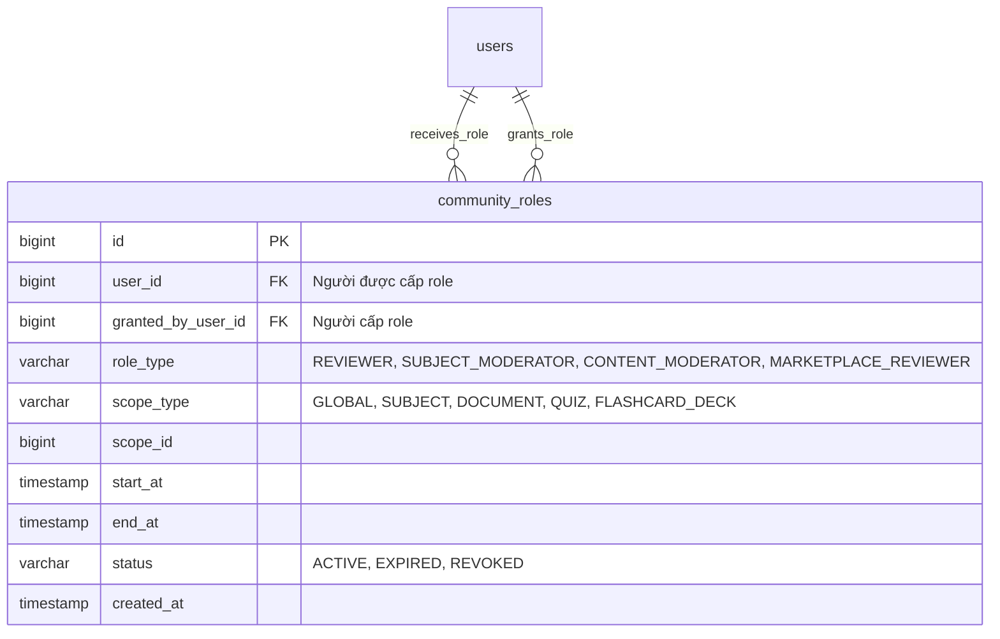
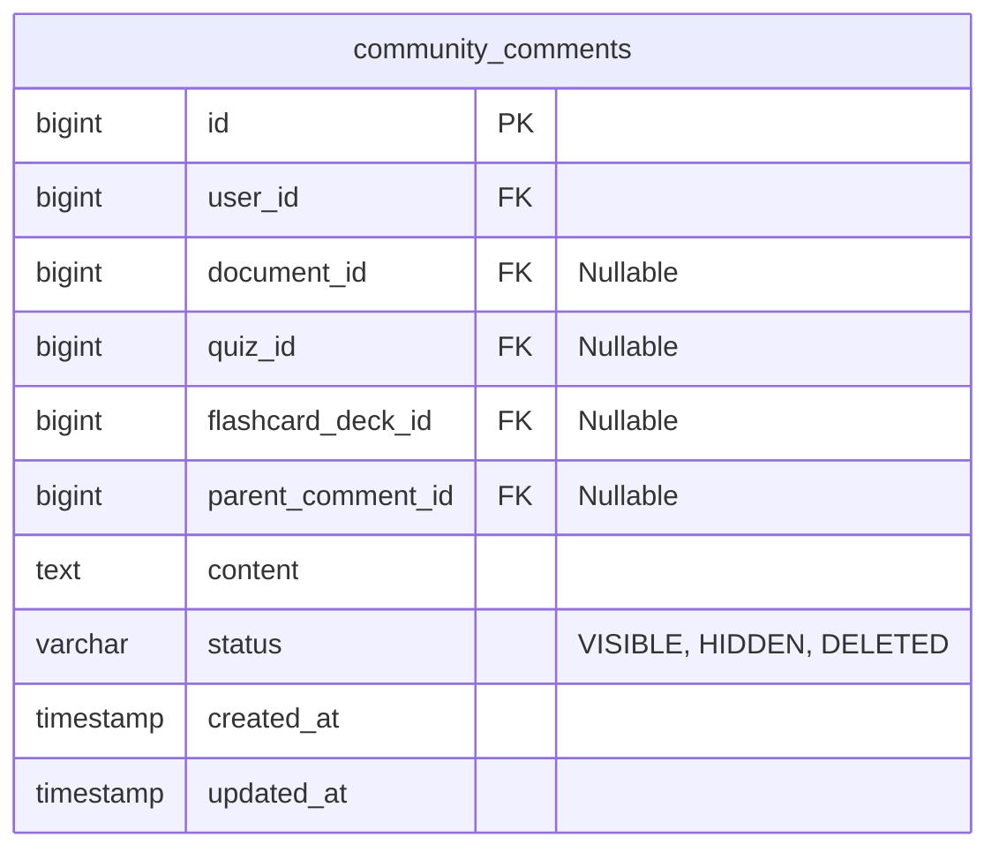
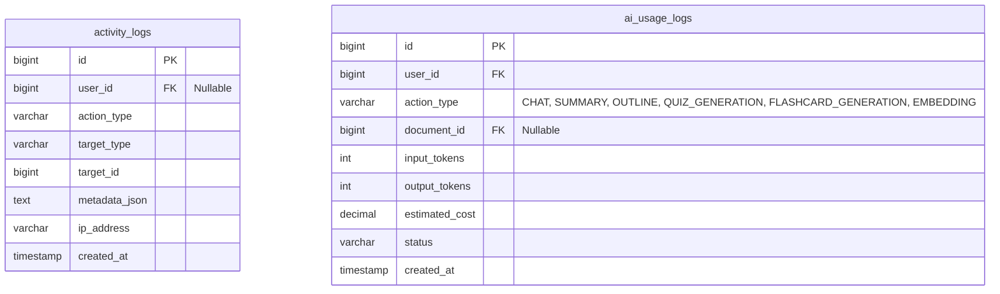

# AI Study Hub – Backend GitHub Project Task Plan V3

> **Update V3:** Đã cân bằng lại workload cho 3 Backend. BE1 là Leader nên không chỉ làm Foundation/Auth mà sẽ **control kiến trúc backend**, **code core RAG**, **code core Community Permission/Role**, kiểm soát API contract, security rule, integration flow và code review. BE2 tập trung Academic/Notebook/Document/File/Tag và hỗ trợ dữ liệu đầu vào cho RAG. BE3 tập trung Quiz/Test/Flashcard/Marketplace/Governance/Reward.
> File này được cập nhật từ V2 sau khi nhận feedback rằng BE1 Leader đang nhẹ việc so với BE2/BE3 và cần nắm các phần core có rủi ro kiến trúc cao.

---


> **Purpose:** File này dùng để đưa lên GitHub Project/Issues cho 3 Backend Java Spring Boot làm song song trong 2 tuần.  
> **Project:** AI Study Hub  
> **Backend stack đề xuất:** Java 17+, Spring Boot 3.x, Spring Security, JWT, Spring Data JPA, PostgreSQL, Flyway/Liquibase, Lombok, Swagger/OpenAPI.  
> **Timeline đề xuất:** 08/06/2026 → 21/06/2026  
> **Team backend:** BE1, BE2, BE3  
> **Nguyên tắc chia việc:** Mỗi module có **1 owner chính**, task tách theo package để giảm conflict Git. Không chia nhiều người cùng sửa một `Controller/Service/Entity` core trong cùng thời điểm.
> **Cấu trúc code chốt:** dùng `entity/` và `repository/` tập trung, `module/*/controller-service-dto`, không tạo `mapper/` riêng; mapping viết trong `Service`.


---

## V3.0. Điều chỉnh quan trọng về vai trò Leader BE1

### Lý do điều chỉnh

Ở bản V2, BE1 đang giữ Foundation/Auth/User/System nên nhìn có vẻ nhiều việc nền tảng nhưng phần nghiệp vụ core lại nhẹ hơn BE2 và BE3. Với vai trò **Leader Backend**, BE1 cần nắm các phần ảnh hưởng trực tiếp đến kiến trúc, security, integration và demo flow, đặc biệt là:

```text
Auth/Security
→ API convention
→ Permission/Role control
→ RAG orchestration
→ Community role permission
→ Integration review
→ Swagger/Postman/demo contract
```

Vì vậy V3 điều chỉnh như sau:

| Backend                                | Vai trò mới                     | Trách nhiệm chính                                                                                                                          |
| -------------------------------------- | ------------------------------- | ------------------------------------------------------------------------------------------------------------------------------------------ |
| **BE1 – Leader/Core Architect**        | Control kiến trúc + code core   | Foundation, Auth, User, Security, **RAG Core**, **Chat/RAG orchestration**, **Community Role/Permission**, Swagger, integration gatekeeper |
| **BE2 – Learning Workspace Owner**     | Code workspace tài liệu         | Academic, Notebook, Document, Upload, Tag, NotebookDocument, hỗ trợ dữ liệu/chunk input cho RAG                                            |
| **BE3 – Practice & Marketplace Owner** | Code practice/community content | Quiz, Test, Flashcard, Marketplace, Review, Report, Badge, clone/browse content                                                            |

### Nguyên tắc mới

```text
BE1 không làm thay tất cả, nhưng BE1 phải control phần core và phần dễ ảnh hưởng toàn hệ thống.
BE2 không tự quyết định RAG flow cuối cùng, chỉ cung cấp document/chunk data đúng contract.
BE3 không tự quyết định permission reviewer/community, phải gọi CommunityPermissionService của BE1.
```

### Các module chuyển owner từ V2 sang V3

| Module/Issue                           | Owner V2 | Owner V3      | Lý do                                                                                |
| -------------------------------------- | -------- | ------------- | ------------------------------------------------------------------------------------ |
| DocumentChunk processing core – BE-016 | BE2      | **BE1**       | Chunking/status/vectorId là đầu vào trực tiếp của RAG, cần leader kiểm soát contract |
| ChatSession – BE-017                   | BE2      | **BE1**       | Chat là entry point của RAG flow, cần thống nhất permission và ownership             |
| ChatMessage + Mock RAG – BE-018        | BE2      | **BE1**       | Đây là core demo AI/RAG, leader cần trực tiếp code để tránh sai kiến trúc            |
| CommunityRole – BE-032                 | BE3      | **BE1**       | Community role là permission core, ảnh hưởng reviewer/moderator/admin                |
| CommunityRole upgrade – BE-047         | BE3      | **BE1**       | Scope permission cần dùng lại ở Marketplace Review và Admin Content Management       |
| Swagger/API contract – BE-038          | BE1      | **BE1**       | Giữ nguyên, nhưng BE1 có thêm quyền reject PR nếu API sai convention                 |
| Postman demo flow – BE-039             | BE2      | **BE1 + BE2** | BE1 control flow, BE2 chuẩn bị workspace/document data                               |


---

## 0. Mục tiêu MVP Backend trong 2 tuần

Backend cần đủ API để demo luồng chính:

```text
Register/Login
→ Create Notebook theo Subject
→ Upload Document vào Notebook
→ Process/Chunk Document
→ Chat AI theo Notebook
→ Create Quiz / Do Test
→ Create Flashcard / Review Flashcard
→ Publish content lên Marketplace
→ Reviewer/Admin approve hoặc reject
→ Student clone/download/report content
→ Notification + Feedback + Community Role + Badge cơ bản
```

---

## 1. Quy ước GitHub Project

### 1.1. Columns đề xuất

```text
Backlog
Todo
In Progress
Code Review
Testing
Done
Blocked
```

### 1.2. Labels đề xuất

```text
type:setup
type:feature
type:bug
type:refactor
type:test
priority:critical
priority:high
priority:medium
priority:low
area:auth
area:user
area:academic
area:notebook
area:document
area:rag
area:chat
area:quiz
area:flashcard
area:marketplace
area:governance
area:community
area:reward
area:notification
area:system
owner:BE1
owner:BE2
owner:BE3
```

### 1.3. Milestones đề xuất

| Milestone                        |     Thời gian | Mục tiêu                                                   |
| -------------------------------- | ------------: | ---------------------------------------------------------- |
| M1 – Foundation & Auth           | 08/06 → 09/06 | Project chạy, Auth/JWT, common structure, DB migration nền |
| M2 – Core Learning Workspace     | 10/06 → 11/06 | Academic, Notebook, Document, Tag                          |
| M3 – AI/RAG & Practice Core      | 12/06 → 13/06 | Chunk, Chat, Quiz, Test                                    |
| M4 – Flashcard & Marketplace     | 14/06 → 16/06 | Flashcard, Publish, Browse, Clone                          |
| M5 – Governance & Community      | 17/06 → 18/06 | Review, Report, Role, Badge, Notification                  |
| M6 – Integration & Stabilization | 19/06 → 21/06 | Fix bug, test API, swagger, demo script                    |

---

## 2. Nguyên tắc chống conflict cho 3 Backend

### 2.1. Không nên làm

```text
BE1 sửa AuthController
BE2 cũng sửa AuthController
BE3 cũng sửa AuthService
```

Cách này dễ conflict, sai convention, trùng DTO, trùng endpoint.

### 2.2. Nên làm

```text
BE1 owner Foundation/Auth/User/Security/RAG Core/Community Permission
BE2 owner Academic/Notebook/Document/File/Tag/Workspace data
BE3 owner Quiz/Test/Flashcard/Marketplace/Governance/Reward
```

Người khác chỉ hỗ trợ bằng cách tạo package phụ, viết test, hoặc review code.

### 2.3. File chung chỉ 1 người được sửa chính

| File/Folder                    | Owner chính       | Ghi chú                                                                                                     |
| ------------------------------ | ----------------- | ----------------------------------------------------------------------------------------------------------- |
| `pom.xml`                      | BE1               | Thêm dependency phải báo nhóm                                                                               |
| `application.yml`              | BE1               | Không commit secret thật                                                                                    |
| `SecurityConfig.java`          | BE1               | BE khác không tự ý sửa                                                                                      |
| `JwtAuthenticationFilter.java` | BE1               | BE khác chỉ dùng                                                                                            |
| `ApiResponse.java`             | BE1               | Format response chung                                                                                       |
| `GlobalExceptionHandler.java`  | BE1               | Format lỗi chung                                                                                            |
| `ErrorCode.java`               | BE1               | BE khác thêm mã lỗi qua PR nhỏ                                                                              |
| `entity/*.java`                | Theo owner entity | Mỗi entity tự khai báo `createdAt/updatedAt` nếu cần, không dùng `BaseEntity` riêng trong cấu trúc hiện tại |
| `V1__init_schema.sql`          | BE1               | Schema migration gốc                                                                                        |
| `docker-compose.yml`           | BE1               | PostgreSQL/local service                                                                                    |

---

## 3. Cấu trúc thư mục backend cần thống nhất từ đầu

> **Chốt kiến trúc:** Team dùng cấu trúc hybrid: `entity/` và `repository/` gom tập trung theo ERD, còn `controller/service/dto` chia theo từng module nghiệp vụ.  
> **Không dùng `mapper/` riêng.** Quy ước mapping `Request DTO → Entity` và `Entity → Response DTO` sẽ được viết trực tiếp trong `Service`, hoặc tách thành private method trong chính `Service` như `toResponse()`, `toEntity()` nếu mapping dài.

```text
src/main/java/com/aistudyhub
│
├── AiStudyHubApplication.java
│
├── config
│   ├── SecurityConfig.java
│   ├── SwaggerConfig.java
│   ├── OpenAIConfig.java
│   ├── CorsConfig.java
│   └── StorageConfig.java
│
├── security
│   ├── JwtAuthenticationFilter.java
│   ├── JwtTokenProvider.java
│   ├── CustomUserDetails.java
│   ├── CustomUserDetailsService.java
│   └── SecurityConstants.java
│
├── common
│   ├── exception
│   │   ├── AppException.java
│   │   ├── ErrorCode.java
│   │   └── GlobalExceptionHandler.java
│   │
│   ├── response
│   │   ├── ApiResponse.java
│   │   └── PaginationResponse.java
│   │
│   ├── enums
│   │   ├── Role.java
│   │   ├── Visibility.java
│   │   ├── MarketStatus.java
│   │   ├── ProcessingStatus.java
│   │   ├── QuestionType.java
│   │   ├── ReportStatus.java
│   │   ├── ReviewResult.java
│   │   ├── CommunityRoleType.java
│   │   └── CommunityScopeType.java
│   │
│   └── utils
│       ├── FileUtil.java
│       ├── DateUtil.java
│       └── ValidationUtil.java
│
├── entity
│   ├── User.java
│   ├── PasswordReset.java
│   ├── Semester.java
│   ├── Combo.java
│   ├── ComboSubject.java
│   ├── Subject.java
│   │
│   ├── Notebook.java
│   ├── NotebookDocument.java
│   │
│   ├── Document.java
│   ├── DocumentChunk.java
│   ├── Tag.java
│   ├── DocumentTag.java
│   │
│   ├── ChatSession.java
│   ├── ChatMessage.java
│   │
│   ├── Quiz.java
│   ├── QuizQuestion.java
│   ├── QuizOption.java
│   ├── Test.java
│   ├── UserQuizProgress.java
│   │
│   ├── FlashcardDeck.java
│   ├── Flashcard.java
│   ├── UserFlashcardProgress.java
│   │
│   ├── MarketReview.java
│   ├── ContentReport.java
│   ├── CommunityRole.java
│   │
│   ├── Badge.java
│   ├── UserBadge.java
│   ├── Notification.java
│   ├── SystemFeedback.java
│   └── SystemConfig.java
│
├── repository
│   ├── UserRepository.java
│   ├── PasswordResetRepository.java
│   ├── SemesterRepository.java
│   ├── ComboRepository.java
│   ├── ComboSubjectRepository.java
│   ├── SubjectRepository.java
│   │
│   ├── NotebookRepository.java
│   ├── NotebookDocumentRepository.java
│   │
│   ├── DocumentRepository.java
│   ├── DocumentChunkRepository.java
│   ├── TagRepository.java
│   ├── DocumentTagRepository.java
│   │
│   ├── ChatSessionRepository.java
│   ├── ChatMessageRepository.java
│   │
│   ├── QuizRepository.java
│   ├── QuizQuestionRepository.java
│   ├── QuizOptionRepository.java
│   ├── TestRepository.java
│   ├── UserQuizProgressRepository.java
│   │
│   ├── FlashcardDeckRepository.java
│   ├── FlashcardRepository.java
│   ├── UserFlashcardProgressRepository.java
│   │
│   ├── MarketReviewRepository.java
│   ├── ContentReportRepository.java
│   ├── CommunityRoleRepository.java
│   │
│   ├── BadgeRepository.java
│   ├── UserBadgeRepository.java
│   ├── NotificationRepository.java
│   ├── SystemFeedbackRepository.java
│   └── SystemConfigRepository.java
│
└── module
    ├── auth
    │   ├── controller
    │   ├── service
    │   └── dto
    │
    ├── user
    │   ├── controller
    │   ├── service
    │   └── dto
    │
    ├── academic
    │   ├── controller
    │   ├── service
    │   └── dto
    │
    ├── notebook
    │   ├── controller
    │   ├── service
    │   └── dto
    │
    ├── document
    │   ├── controller
    │   ├── service
    │   └── dto
    │
    ├── ai
    │   ├── controller
    │   ├── service
    │   ├── dto
    │   └── client
    │
    ├── chat
    │   ├── controller
    │   ├── service
    │   └── dto
    │
    ├── quiz
    │   ├── controller
    │   ├── service
    │   └── dto
    │
    ├── flashcard
    │   ├── controller
    │   ├── service
    │   └── dto
    │
    ├── marketplace
    │   ├── controller
    │   ├── service
    │   └── dto
    │
    ├── governance
    │   ├── controller
    │   ├── service
    │   └── dto
    │
    ├── community
    │   ├── controller
    │   ├── service
    │   └── dto
    │
    ├── notification
    │   ├── controller
    │   ├── service
    │   └── dto
    │
    ├── reward
    │   ├── controller
    │   ├── service
    │   └── dto
    │
    ├── feedback
    │   ├── controller
    │   ├── service
    │   └── dto
    │
    └── admin
        ├── controller
        ├── service
        └── dto
```

### 3.1. Quy ước mapping khi không dùng `mapper/`

```text
Controller chỉ nhận request và trả ApiResponse.
Service xử lý business logic và tự map DTO ↔ Entity.
Repository chỉ truy vấn database.
Không trả trực tiếp Entity ra frontend.
Không để Controller gọi Repository.
Nếu mapping dài, tạo private method trong Service: toResponse(), toEntity(), toDetailResponse().
```

### 3.2. Quy ước owner theo cấu trúc thư mục

| Nhóm file                                                                                                                                        | Owner chính                     | Ghi chú                                                  |
| ------------------------------------------------------------------------------------------------------------------------------------------------ | ------------------------------- | -------------------------------------------------------- |
| `config/`, `security/`, `common/`                                                                                                                | BE1                             | File nền tảng, hạn chế nhiều người sửa cùng lúc          |
| `entity/User`, `PasswordReset`, `DocumentChunk`, `ChatSession`, `ChatMessage`, `CommunityRole`, `Notification`, `SystemFeedback`, `SystemConfig` | BE1                             | Auth/User/System + RAG Core + Community Permission group |
| `entity/Semester`, `Combo`, `Subject`, `Notebook`, `NotebookDocument`, `Document`, `Tag`, `DocumentTag`                                          | BE2                             | Academic/Notebook/Document/File/Tag workspace group      |
| `entity/Quiz`, `Test`, `Flashcard`, `MarketReview`, `ContentReport`, `Badge`, `UserBadge`                                                        | BE3                             | Practice/Marketplace/Governance/Reward group             |
| `repository/*`                                                                                                                                   | Theo owner của entity tương ứng | Ai owner entity thì owner repository                     |
| `module/*/controller/service/dto`                                                                                                                | Theo module owner               | Không tạo folder `mapper/`                               |

---

## 4. API response format thống nhất

### 4.1. Success response

```json
{
  "success": true,
  "message": "Success",
  "data": {}
}
```

### 4.2. Error response

```json
{
  "success": false,
  "message": "Document not found",
  "errorCode": "DOCUMENT_NOT_FOUND"
}
```

### 4.3. Pagination response

```json
{
  "success": true,
  "message": "Success",
  "data": {
    "items": [],
    "page": 0,
    "size": 10,
    "totalElements": 100,
    "totalPages": 10
  }
}
```

---

## 5. Use Case Coverage Map

| Actor    | Use case                                       | Module                 | Backend owner                      |
| -------- | ---------------------------------------------- | ---------------------- | ---------------------------------- |
| Guest    | Register                                       | Auth                   | BE1                                |
| Guest    | Login                                          | Auth                   | BE1                                |
| Guest    | Forgot password                                | Auth                   | BE1                                |
| Student  | Logout                                         | Auth                   | BE1                                |
| Student  | View/update profile                            | User                   | BE1                                |
| Student  | View subjects/semesters/combos                 | Academic               | BE2                                |
| Student  | Create/update/delete notebook                  | Notebook               | BE2                                |
| Student  | Upload document                                | Document               | BE2                                |
| Student  | Preview/download/delete document               | Document               | BE2                                |
| Student  | Search/filter/tag document                     | Document               | BE2                                |
| Student  | Add/remove document from notebook              | Document/Notebook      | BE2                                |
| Student  | Ask AI in notebook                             | Chat/RAG               | **BE1**                            |
| Student  | View chat history                              | Chat                   | **BE1**                            |
| Student  | Create quiz bank                               | Quiz                   | BE3                                |
| Student  | Add/edit/delete questions/options              | Quiz                   | BE3                                |
| Student  | Start test                                     | Test                   | BE3                                |
| Student  | Submit answer                                  | Test                   | BE3                                |
| Student  | Submit test/view score                         | Test                   | BE3                                |
| Student  | Create flashcard deck                          | Flashcard              | BE3                                |
| Student  | Review flashcard/spaced repetition             | Flashcard              | BE3                                |
| Student  | Publish document/quiz/flashcard to marketplace | Marketplace            | BE3                                |
| Student  | Browse/search marketplace                      | Marketplace            | BE3                                |
| Student  | Clone marketplace content                      | Marketplace            | BE3                                |
| Student  | Report bad content                             | Governance             | BE3                                |
| Student  | Submit system feedback                         | System                 | BE1                                |
| Student  | View notifications                             | Notification           | BE1                                |
| Reviewer | Review marketplace content                     | Marketplace/Governance | BE3, permission checked by **BE1** |
| Reviewer | Approve/reject content                         | Marketplace/Governance | BE3, permission checked by **BE1** |
| Admin    | Manage master data                             | Academic/System        | BE2/BE1                            |
| Admin    | Manage users                                   | User                   | BE1                                |
| Admin    | Manage community roles                         | Community              | **BE1**                            |
| Admin    | Manage badges/rewards                          | Reward                 | BE3                                |
| Admin    | Manage system configs                          | System                 | BE1                                |
| Admin    | Resolve reports/feedback                       | Governance/System      | BE3/BE1                            |

---

## 6. Backend assignment overview

| Backend          | Main ownership                                                                                                                                           | Không nên sửa trực tiếp                                                                |
| ---------------- | -------------------------------------------------------------------------------------------------------------------------------------------------------- | -------------------------------------------------------------------------------------- |
| **BE1 – Leader** | Foundation, Auth, User, Security, **RAG Core**, Chat/RAG orchestration, **Community Role/Permission**, Notification/System, Swagger, integration control | Document upload UI logic, Quiz/Test scoring internals, Flashcard CRUD internals        |
| **BE2**          | Academic, Notebook, Document metadata/upload, Tag, NotebookDocument, workspace data for RAG                                                              | SecurityConfig, RAG orchestration, Community permission, Quiz/Test core                |
| **BE3**          | Quiz, Test, Flashcard, Marketplace, Governance/Report/Review, Badge/Reward                                                                               | Auth/Security core, RAG orchestration, Community permission core, Document upload core |

---

# 7. GitHub Issues chi tiết theo module

---

## EPIC 01 – Backend Foundation

### Issue BE-001: Setup Spring Boot project foundation

- **Owner:** BE1
- **Labels:** `type:setup`, `priority:critical`, `owner:BE1`
- **Estimate:** 6h
- **Start:** 08/06/2026
- **Deadline:** 08/06/2026
- **Depends on:** None
- **Branch:** `feature/backend-foundation`

#### Description

Khởi tạo cấu trúc nền tảng Spring Boot để cả 3 backend có thể code module riêng mà không conflict.

#### Tasks

- [ ] Tạo Spring Boot project package `com.aistudyhub`
- [ ] Cấu hình PostgreSQL trong `application.yml`
- [ ] Thêm dependencies: Spring Web, Spring Data JPA, PostgreSQL Driver, Validation, Security, Lombok, JWT, Swagger/OpenAPI
- [ ] Tạo `ApiResponse`
- [ ] Tạo `PaginationResponse`
- [ ] Thống nhất các entity tự khai báo `createdAt`, `updatedAt` nếu cần
- [ ] Tạo `AppException`
- [ ] Tạo `ErrorCode`
- [ ] Tạo `GlobalExceptionHandler`
- [ ] Tạo `CorsConfig`
- [ ] Tạo `SwaggerConfig`
- [ ] Tạo `docker-compose.yml` cho PostgreSQL local

#### Acceptance Criteria

- [ ] App chạy được bằng `mvn spring-boot:run`
- [ ] Swagger mở được
- [ ] Connect được PostgreSQL
- [ ] API test `/api/health` trả success
- [ ] Cả nhóm pull code về chạy được local

---

### Issue BE-002: Define common enums

- **Owner:** BE1
- **Labels:** `type:setup`, `priority:critical`, `owner:BE1`
- **Estimate:** 3h
- **Start:** 08/06/2026
- **Deadline:** 08/06/2026
- **Depends on:** BE-001
- **Branch:** `feature/common-enums`

#### Tasks

- [ ] Tạo `Role`: `STUDENT`, `ADMIN`
- [ ] Tạo `Visibility`: `PRIVATE`, `PUBLIC_LINK`, `MARKETPLACE`
- [ ] Tạo `MarketStatus`: `NONE`, `PENDING`, `APPROVED`, `REJECTED`
- [ ] Tạo `ProcessingStatus`: `PENDING`, `PROCESSING`, `SUCCESS`, `FAILED`
- [ ] Tạo `QuestionType`: `SINGLE_CHOICE`, `MULTIPLE_CHOICE`, `FILL_IN_THE_BLANK`
- [ ] Trạng thái test có thể dùng field `status` dạng string/enum nội bộ trong entity `Test`: `DRAFT`, `IN_PROGRESS`, `COMPLETED`
- [ ] `ChatMessage.senderRole` dùng giá trị thống nhất `USER`, `AI` trong service/chat DTO
- [ ] Không tạo `ContentType` riêng trong `common/enums`; các API marketplace/report dùng endpoint hoặc nullable target theo ERD
- [ ] Tạo `ReportStatus`: `PENDING_ADMIN`, `RESOLVED`, `REJECTED`
- [ ] Tạo `CommunityRoleType`: `REVIEWER`, `SUBJECT_MODERATOR`, `CONTENT_MODERATOR`, `MARKETPLACE_REVIEWER`
- [ ] Tạo `CommunityScopeType`: `GLOBAL`, `SUBJECT`, `DOCUMENT`, `QUIZ`, `FLASHCARD_DECK`

#### Acceptance Criteria

- [ ] Các module khác import enum dùng chung được
- [ ] Không dùng hard-code string trong service chính

---

## EPIC 02 – Auth, User & Security

### Issue BE-003: Implement User entity and repository

- **Owner:** BE1
- **Labels:** `type:feature`, `priority:critical`, `area:user`, `owner:BE1`
- **Estimate:** 4h
- **Start:** 08/06/2026
- **Deadline:** 08/06/2026
- **Depends on:** BE-001, BE-002
- **Branch:** `feature/user-entity`

#### Tasks

- [ ] Tạo `User.java`
- [ ] Fields: `id`, `googleId`, `type`, `email`, `passwordHash`, `fullName`, `avatarUrl`, `currentSemesterId`, `comboId`, `role`, `reputationPoints`, `isActive`, `createdAt`, `updatedAt`
- [ ] Tạo `UserRepository`
- [ ] Method `existsByEmail`
- [ ] Method `findByEmail`
- [ ] Method `findByIdAndIsActiveTrue`
- [ ] Tạo DTO `UserProfileResponse`
- [ ] Map thủ công trong service, không tạo mapper layer riêng

#### Acceptance Criteria

- [ ] Hibernate tạo được bảng users
- [ ] Email unique
- [ ] Role dùng enum
- [ ] Không expose `passwordHash` ra response

---

### Issue BE-004: Implement Register API

- **Owner:** BE1
- **Labels:** `type:feature`, `priority:critical`, `area:auth`, `owner:BE1`
- **Estimate:** 4h
- **Start:** 08/06/2026
- **Deadline:** 09/06/2026
- **Depends on:** BE-003
- **Branch:** `feature/auth-register`

#### Endpoint

```http
POST /api/auth/register
```

#### Request

```json
{
  "email": "student@fpt.edu.vn",
  "password": "123456",
  "fullName": "Nguyen Van A",
  "currentSemesterId": 1,
  "comboId": null
}
```

#### Tasks

- [ ] Tạo `RegisterRequest`
- [ ] Validate email/password/fullName
- [ ] Check email duplicated
- [ ] Hash password bằng BCrypt
- [ ] Set role mặc định `STUDENT`
- [ ] Set `isActive = true`
- [ ] Return user profile basic

#### Acceptance Criteria

- [ ] Register thành công lưu user vào DB
- [ ] Trùng email trả lỗi rõ ràng
- [ ] Password được hash
- [ ] Response không chứa password

---

### Issue BE-005: Implement Login API with JWT

- **Owner:** BE1
- **Labels:** `type:feature`, `priority:critical`, `area:auth`, `owner:BE1`
- **Estimate:** 6h
- **Start:** 09/06/2026
- **Deadline:** 09/06/2026
- **Depends on:** BE-003, BE-004
- **Branch:** `feature/auth-login-jwt`

#### Endpoint

```http
POST /api/auth/login
```

#### Tasks

- [ ] Tạo `LoginRequest`
- [ ] Tạo `AuthResponse`
- [ ] Tạo `JwtTokenProvider`
- [ ] Tạo `CustomUserDetails`
- [ ] Tạo `CustomUserDetailsService`
- [ ] Tạo `JwtAuthenticationFilter`
- [ ] Cấu hình `SecurityConfig`
- [ ] Login check email/password
- [ ] Chặn user `isActive = false`
- [ ] Return JWT + user profile

#### Acceptance Criteria

- [ ] Login đúng trả access token
- [ ] Login sai trả lỗi
- [ ] API protected cần Bearer token
- [ ] `/api/auth/**` public
- [ ] Swagger dùng được với JWT

---

### Issue BE-006: Implement Forgot Password and Reset Password

- **Owner:** BE1
- **Labels:** `type:feature`, `priority:high`, `area:auth`, `owner:BE1`
- **Estimate:** 5h
- **Start:** 09/06/2026
- **Deadline:** 10/06/2026
- **Depends on:** BE-003
- **Branch:** `feature/auth-forgot-password`

#### Endpoints

```http
POST /api/auth/forgot-password
POST /api/auth/reset-password
```

#### Tasks

- [ ] Tạo `PasswordReset.java`
- [ ] Tạo `PasswordResetRepository`
- [ ] Tạo `ForgotPasswordRequest`
- [ ] Tạo `ResetPasswordRequest`
- [ ] Sinh reset token
- [ ] Lưu `expiredAt`
- [ ] Mock gửi email bằng log console
- [ ] Reset password bằng token
- [ ] Token hết hạn không dùng được

#### Acceptance Criteria

- [ ] Gửi forgot password tạo token
- [ ] Reset password đổi password_hash
- [ ] Token expired trả lỗi
- [ ] Token invalid trả lỗi

---

### Issue BE-007: Implement User profile APIs

- **Owner:** BE1
- **Labels:** `type:feature`, `priority:high`, `area:user`, `owner:BE1`
- **Estimate:** 4h
- **Start:** 10/06/2026
- **Deadline:** 10/06/2026
- **Depends on:** BE-005
- **Branch:** `feature/user-profile`

#### Endpoints

```http
GET /api/users/me
PUT /api/users/me
PATCH /api/users/me/change-password
```

#### Tasks

- [ ] Get current user from JWT
- [ ] Update fullName/avatar/currentSemester/combo
- [ ] Change password
- [ ] Validate old password
- [ ] Return updated profile

#### Acceptance Criteria

- [ ] User xem profile của chính mình
- [ ] User sửa profile của chính mình
- [ ] Không sửa được user khác
- [ ] Change password cần old password đúng

---

## EPIC 03 – Academic Master Data

### Issue BE-008: Implement Semester APIs

- **Owner:** BE2
- **Labels:** `type:feature`, `priority:high`, `area:academic`, `owner:BE2`
- **Estimate:** 4h
- **Start:** 08/06/2026
- **Deadline:** 09/06/2026
- **Depends on:** BE-001, BE-002
- **Branch:** `feature/academic-semesters`

#### Endpoints

```http
GET /api/semesters
POST /api/admin/semesters
PUT /api/admin/semesters/{id}
DELETE /api/admin/semesters/{id}
```

#### Tasks

- [ ] Tạo `Semester`
- [ ] Tạo `SemesterRepository`
- [ ] Tạo `SemesterService`
- [ ] Tạo `SemesterController`
- [ ] Public API list semesters
- [ ] Admin CRUD semesters
- [ ] Validate unique code

#### Acceptance Criteria

- [ ] Student xem list semester được
- [ ] Admin tạo/sửa/xóa semester được
- [ ] Code không trùng

---

### Issue BE-009: Implement Subject APIs

- **Owner:** BE2
- **Labels:** `type:feature`, `priority:critical`, `area:academic`, `owner:BE2`
- **Estimate:** 5h
- **Start:** 08/06/2026
- **Deadline:** 09/06/2026
- **Depends on:** BE-001, BE-002
- **Branch:** `feature/academic-subjects`

#### Endpoints

```http
GET /api/subjects
GET /api/subjects/{id}
POST /api/admin/subjects
PUT /api/admin/subjects/{id}
DELETE /api/admin/subjects/{id}
```

#### Tasks

- [ ] Tạo `Subject`
- [ ] Tạo `SubjectRepository`
- [ ] Tạo `SubjectService`
- [ ] Tạo `SubjectController`
- [ ] Search theo keyword/code/name
- [ ] Filter theo `standardSemesterNumber`
- [ ] Admin CRUD

#### Acceptance Criteria

- [ ] Frontend lấy subject để tạo notebook/document được
- [ ] Subject code unique
- [ ] Không xóa subject nếu đang có notebook/document, hoặc soft delete nếu cần

---

### Issue BE-010: Implement Combo and ComboSubject APIs

- **Owner:** BE2
- **Labels:** `type:feature`, `priority:medium`, `area:academic`, `owner:BE2`
- **Estimate:** 5h
- **Start:** 09/06/2026
- **Deadline:** 10/06/2026
- **Depends on:** BE-009
- **Branch:** `feature/academic-combos`

#### Endpoints

```http
GET /api/combos
GET /api/combos/{id}/subjects
POST /api/admin/combos
POST /api/admin/combos/{id}/subjects/{subjectId}
DELETE /api/admin/combos/{id}/subjects/{subjectId}
```

#### Tasks

- [ ] Tạo `Combo`
- [ ] Tạo `ComboSubject`
- [ ] Tạo repositories
- [ ] List combo
- [ ] List subjects by combo
- [ ] Admin add/remove subject in combo
- [ ] Validate không add trùng subject vào combo

#### Acceptance Criteria

- [ ] User chọn combo lúc update profile được
- [ ] Lấy được subject theo combo
- [ ] Không tạo duplicate mapping

---

## EPIC 04 – Notebook Workspace

### Issue BE-011: Implement Notebook CRUD

- **Owner:** BE2
- **Labels:** `type:feature`, `priority:critical`, `area:notebook`, `owner:BE2`
- **Estimate:** 6h
- **Start:** 10/06/2026
- **Deadline:** 11/06/2026
- **Depends on:** BE-009, BE-005
- **Branch:** `feature/notebook-crud`

#### Endpoints

```http
POST /api/notebooks
GET /api/notebooks
GET /api/notebooks/{id}
PUT /api/notebooks/{id}
DELETE /api/notebooks/{id}
```

#### Tasks

- [ ] Tạo `Notebook`
- [ ] Tạo `NotebookRepository`
- [ ] Tạo `NotebookService`
- [ ] Tạo `NotebookController`
- [ ] Create notebook theo subject
- [ ] List notebook của current user
- [ ] Get notebook detail
- [ ] Update title/subject
- [ ] Delete notebook
- [ ] Check ownership

#### Acceptance Criteria

- [ ] User chỉ xem/sửa/xóa notebook của mình
- [ ] Notebook phải gắn với subject tồn tại
- [ ] Delete notebook không làm lỗi chat/quiz/flashcard cascade

---

## EPIC 05 – Document Repository, Tag & Notebook Document

### Issue BE-012: Implement Document metadata APIs

- **Owner:** BE2
- **Labels:** `type:feature`, `priority:critical`, `area:document`, `owner:BE2`
- **Estimate:** 7h
- **Start:** 10/06/2026
- **Deadline:** 11/06/2026
- **Depends on:** BE-009, BE-005
- **Branch:** `feature/document-metadata`

#### Endpoints

```http
POST /api/documents
GET /api/documents
GET /api/documents/{id}
PUT /api/documents/{id}
DELETE /api/documents/{id}
```

#### Tasks

- [ ] Tạo `Document`
- [ ] Fields: `user`, `subject`, `title`, `description`, `fileUrl`, `cloudFilePath`, `fileType`, `fileSize`, `visibility`, `marketStatus`, `downloadCount`, `reviewCount`, `acceptPercentage`, `aiVerdictNote`, `processingStatus`
- [ ] Tạo `DocumentRepository`
- [ ] Create metadata document
- [ ] List document của current user
- [ ] Search by keyword
- [ ] Filter by subjectId, fileType, visibility, processingStatus
- [ ] Update document metadata
- [ ] Delete document metadata
- [ ] Check ownership

#### Acceptance Criteria

- [ ] User chỉ sửa/xóa document của mình
- [ ] Có `cloudFilePath` để sau này xóa file vật lý
- [ ] Default `visibility = PRIVATE`
- [ ] Default `marketStatus = NONE`
- [ ] Default `processingStatus = PENDING`

---

### Issue BE-013: Implement Upload file service mock/local

- **Owner:** BE2
- **Labels:** `type:feature`, `priority:high`, `area:document`, `owner:BE2`
- **Estimate:** 6h
- **Start:** 11/06/2026
- **Deadline:** 12/06/2026
- **Depends on:** BE-012
- **Branch:** `feature/document-upload`

#### Endpoint

```http
POST /api/documents/upload
```

#### Tasks

- [ ] Support `multipart/form-data`
- [ ] Validate file type: pdf, docx, pptx, txt
- [ ] Validate max file size from config
- [ ] Save file local hoặc mock cloud
- [ ] Generate `fileUrl`
- [ ] Generate `cloudFilePath`
- [ ] Create document metadata
- [ ] Return document response

#### Acceptance Criteria

- [ ] Upload file thành công
- [ ] File type sai bị reject
- [ ] File quá dung lượng bị reject
- [ ] Document record được tạo sau upload
- [ ] API đủ để frontend gọi demo

---

### Issue BE-014: Implement Tag and DocumentTag APIs

- **Owner:** BE2
- **Labels:** `type:feature`, `priority:medium`, `area:document`, `owner:BE2`
- **Estimate:** 5h
- **Start:** 11/06/2026
- **Deadline:** 12/06/2026
- **Depends on:** BE-012
- **Branch:** `feature/document-tags`

#### Endpoints

```http
GET /api/tags
POST /api/tags
POST /api/documents/{documentId}/tags/{tagId}
DELETE /api/documents/{documentId}/tags/{tagId}
GET /api/documents/{documentId}/tags
```

#### Tasks

- [ ] Tạo `Tag`
- [ ] Tạo `DocumentTag`
- [ ] Tạo repositories
- [ ] Create custom tag
- [ ] List tags
- [ ] Add tag to document
- [ ] Remove tag from document
- [ ] Validate duplicate tag mapping
- [ ] Check document ownership

#### Acceptance Criteria

- [ ] Gắn/xóa tag cho document được
- [ ] Không duplicate tag trên cùng document
- [ ] User không gắn tag vào document của người khác nếu không có quyền

---

### Issue BE-015: Implement NotebookDocument APIs

- **Owner:** BE2
- **Labels:** `type:feature`, `priority:critical`, `area:notebook`, `area:document`, `owner:BE2`
- **Estimate:** 5h
- **Start:** 12/06/2026
- **Deadline:** 12/06/2026
- **Depends on:** BE-011, BE-012
- **Branch:** `feature/notebook-documents`

#### Endpoints

```http
POST /api/notebooks/{notebookId}/documents/{documentId}
DELETE /api/notebooks/{notebookId}/documents/{documentId}
GET /api/notebooks/{notebookId}/documents
```

#### Tasks

- [ ] Tạo `NotebookDocument`
- [ ] Tạo `NotebookDocumentRepository`
- [ ] Add document to notebook
- [ ] Remove document from notebook
- [ ] List documents in notebook
- [ ] Validate notebook ownership
- [ ] Validate document ownership hoặc document public/marketplace
- [ ] Validate duplicate mapping

#### Acceptance Criteria

- [ ] Notebook có thể chứa nhiều document
- [ ] Một document có thể nằm ở nhiều notebook
- [ ] Không add trùng
- [ ] User không add document private của người khác

---

## EPIC 06 – Document Chunk & RAG Chat

### Issue BE-016: Implement DocumentChunk APIs and processing status

- **Owner:** BE1
- **Labels:** `type:feature`, `priority:high`, `area:rag`, `area:document`, `owner:BE1`
- **Estimate:** 7h
- **Start:** 12/06/2026
- **Deadline:** 13/06/2026
- **Depends on:** BE-012
- **Branch:** `feature/document-chunks`

#### Leader note

Issue này được chuyển cho **BE1 Leader** vì đây là phần core của RAG, ảnh hưởng trực tiếp đến demo flow, API contract, permission, cited sources và khả năng tích hợp với Quiz/Flashcard generation sau này. BE2 chỉ cung cấp document/upload/notebook data đúng contract.

#### Endpoints

```http
POST /api/documents/{documentId}/process
GET /api/documents/{documentId}/chunks
DELETE /api/documents/{documentId}/chunks
```

#### Tasks

- [ ] Tạo `DocumentChunk`
- [ ] Tạo `DocumentChunkRepository`
- [ ] Tạo `DocumentChunkService`
- [ ] Nhận input từ Document của BE2 thông qua `documentId`
- [ ] Validate document ownership hoặc quyền truy cập document
- [ ] Mock text extraction từ file hoặc nhận text input tạm
- [ ] Normalize text: remove empty lines, trim, preserve page/section marker nếu có
- [ ] Split text thành chunks theo rule thống nhất: `chunkSize`, `overlap`, `chunkIndex`
- [ ] Lưu `chunkIndex`, `content`, `tokenEstimate`, `sourcePage`, `sourceSection` nếu có
- [ ] Sinh mock `vectorId` để sau này thay bằng Vector DB thật
- [ ] Tạo service method `findRelevantChunks(notebookId, question, topK)` cho Chat/RAG dùng lại
- [ ] Update `processingStatus` theo đúng vòng đời `PENDING → PROCESSING → SUCCESS/FAILED`
- [ ] Handle lỗi và rollback trạng thái nếu process fail

#### Acceptance Criteria

- [ ] Process document tạo chunks
- [ ] Chunk có thứ tự
- [ ] Document status đổi đúng
- [ ] Nếu lỗi thì status `FAILED`

---

### Issue BE-017: Implement Chat Session APIs

- **Owner:** BE1
- **Labels:** `type:feature`, `priority:critical`, `area:chat`, `owner:BE1`
- **Estimate:** 5h
- **Start:** 13/06/2026
- **Deadline:** 14/06/2026
- **Depends on:** BE-011
- **Branch:** `feature/chat-sessions`

#### Leader note

Issue này được chuyển cho **BE1 Leader** vì đây là phần core của RAG, ảnh hưởng trực tiếp đến demo flow, API contract, permission, cited sources và khả năng tích hợp với Quiz/Flashcard generation sau này. BE2 chỉ cung cấp document/upload/notebook data đúng contract.

#### Endpoints

```http
POST /api/notebooks/{notebookId}/chat-sessions
GET /api/notebooks/{notebookId}/chat-sessions
GET /api/chat-sessions/{sessionId}
DELETE /api/chat-sessions/{sessionId}
```

#### Tasks

- [ ] Tạo `ChatSession`
- [ ] Tạo `ChatSessionRepository`
- [ ] Tạo `ChatSessionService`
- [ ] Create session in notebook
- [ ] List sessions by notebook
- [ ] Get session detail
- [ ] Delete session
- [ ] Check notebook ownership

#### Acceptance Criteria

- [ ] User tạo session chat trong notebook được
- [ ] User chỉ xem session của mình
- [ ] Delete session xóa messages theo cascade hoặc service cleanup

---

### Issue BE-018: Implement Chat Message and Mock RAG Answer API

- **Owner:** BE1
- **Labels:** `type:feature`, `priority:critical`, `area:chat`, `area:rag`, `owner:BE1`
- **Estimate:** 8h
- **Start:** 14/06/2026
- **Deadline:** 15/06/2026
- **Depends on:** BE-016, BE-017
- **Branch:** `feature/chat-messages-rag`

#### Leader note

Issue này được chuyển cho **BE1 Leader** vì đây là phần core của RAG, ảnh hưởng trực tiếp đến demo flow, API contract, permission, cited sources và khả năng tích hợp với Quiz/Flashcard generation sau này. BE2 chỉ cung cấp document/upload/notebook data đúng contract.

#### Endpoint

```http
POST /api/chat-sessions/{sessionId}/messages
GET /api/chat-sessions/{sessionId}/messages
```

#### Tasks

- [ ] Tạo `ChatMessage`
- [ ] Tạo `ChatMessageRepository`
- [ ] Save user message
- [ ] Retrieve related chunks by notebook documents qua `findRelevantChunks()`
- [ ] Mock ranking top chunks theo keyword overlap/question similarity đơn giản
- [ ] Mock AI answer from top chunks theo format dễ demo
- [ ] Save AI message
- [ ] Generate `citedSources` JSON gồm `documentId`, `documentTitle`, `chunkIndex`, `sourcePage`, `excerpt`
- [ ] Ghi log AI usage cơ bản nếu module Activity/AI Usage đã có
- [ ] Return both user message and AI message
- [ ] Ensure `messageSequence` tăng đúng

#### Acceptance Criteria

- [ ] Gửi câu hỏi lưu được user message
- [ ] Hệ thống trả AI message mock
- [ ] Có citation dạng JSON gồm `documentId`, `chunkIndex`
- [ ] List message đúng thứ tự

---

## EPIC 07 – Quiz Bank & Test Practice

### Issue BE-019: Implement Quiz Bank CRUD

- **Owner:** BE3
- **Labels:** `type:feature`, `priority:critical`, `area:quiz`, `owner:BE3`
- **Estimate:** 7h
- **Start:** 08/06/2026
- **Deadline:** 10/06/2026
- **Depends on:** BE-001, BE-002
- **Branch:** `feature/quiz-bank`

#### Endpoints

```http
POST /api/quizzes
GET /api/quizzes
GET /api/quizzes/{id}
PUT /api/quizzes/{id}
DELETE /api/quizzes/{id}
```

#### Tasks

- [ ] Tạo `Quiz`
- [ ] Tạo `QuizRepository`
- [ ] Tạo `QuizService`
- [ ] Tạo `QuizController`
- [ ] Create quiz with notebookId/subjectId
- [ ] List quiz của current user
- [ ] Filter by subjectId, examType, visibility, marketStatus
- [ ] Update quiz metadata
- [ ] Delete quiz
- [ ] Check ownership

#### Acceptance Criteria

- [ ] User tạo quiz cá nhân được
- [ ] Quiz default private
- [ ] User không sửa quiz của người khác
- [ ] Quiz có thể gắn notebook hoặc subject

---

### Issue BE-020: Implement Quiz Question and Option APIs

- **Owner:** BE3
- **Labels:** `type:feature`, `priority:critical`, `area:quiz`, `owner:BE3`
- **Estimate:** 7h
- **Start:** 10/06/2026
- **Deadline:** 11/06/2026
- **Depends on:** BE-019
- **Branch:** `feature/quiz-questions-options`

#### Endpoints

```http
POST /api/quizzes/{quizId}/questions
GET /api/quizzes/{quizId}/questions
PUT /api/questions/{questionId}
DELETE /api/questions/{questionId}
POST /api/questions/{questionId}/options
PUT /api/options/{optionId}
DELETE /api/options/{optionId}
```

#### Tasks

- [ ] Tạo `QuizQuestion`
- [ ] Tạo `QuizOption`
- [ ] Tạo repositories
- [ ] Add question to quiz
- [ ] Add options to question
- [ ] Update question
- [ ] Delete question
- [ ] Update option
- [ ] Delete option
- [ ] Validate at least one correct option for choice question

#### Acceptance Criteria

- [ ] Tạo được question/option
- [ ] SINGLE_CHOICE chỉ nên có 1 correct option
- [ ] MULTIPLE_CHOICE có thể có nhiều correct options
- [ ] FILL_IN_THE_BLANK có thể dùng option_text làm đáp án chuẩn
- [ ] Check ownership qua quiz owner

---

### Issue BE-021: Implement Generate Quiz Mock API from Notebook/Document

- **Owner:** BE3
- **Labels:** `type:feature`, `priority:medium`, `area:quiz`, `area:rag`, `owner:BE3`
- **Estimate:** 6h
- **Start:** 11/06/2026
- **Deadline:** 12/06/2026
- **Depends on:** BE-019, BE-020
- **Branch:** `feature/quiz-generate-mock`

#### Endpoint

```http
POST /api/quizzes/generate
```

#### Tasks

- [ ] Request nhận `notebookId`, `documentId`, `numberOfQuestions`, `questionType`
- [ ] Mock generate question từ document chunks nếu có
- [ ] Nếu chưa có chunks, tạo câu hỏi mẫu
- [ ] Save quiz/questions/options
- [ ] Return generated quiz detail

#### Acceptance Criteria

- [ ] User generate quiz từ notebook được
- [ ] API không phụ thuộc AI thật
- [ ] Dữ liệu lưu đúng vào quiz bank
- [ ] Có thể demo trước lớp

---

### Issue BE-022: Implement Test start and answer APIs

* **Owner:** BE3
* **Labels:** `type:feature`, `priority:critical`, `area:quiz`, `owner:BE3`
* **Estimate:** 8h
* **Start:** 12/06/2026
* **Deadline:** 13/06/2026
* **Depends on:** BE-019, BE-020
* **Branch:** `feature/test-practice`

#### Description

Xây dựng API tạo test từ quiz bank và cho phép user trả lời từng câu hỏi.
API tạo test phải hỗ trợ 3 mode:

```text
ALL       = lấy toàn bộ question trong quiz
SELECTED  = user chọn từng question để tạo test
RANDOM    = hệ thống random N question từ quiz
```

#### Endpoints

```http
POST /api/quizzes/{quizId}/tests
GET /api/tests/{testId}
POST /api/tests/{testId}/answers
```

#### Request tạo test

```json
{
  "title": "Random test SWR302",
  "duration": 15,
  "selectionMode": "RANDOM",
  "questionIds": [],
  "randomCount": 10,
  "shuffleQuestions": true,
  "shuffleOptions": true
}
```

#### Tasks

* [ ] Tạo `Test`
* [ ] Tạo `UserQuizProgress`
* [ ] Tạo `TestRepository`
* [ ] Tạo `UserQuizProgressRepository`
* [ ] Tạo `TestController`
* [ ] Tạo `TestService`
* [ ] Tạo `StartTestRequest`
* [ ] Tạo `SubmitAnswerRequest`
* [ ] Tạo `TestResponse`
* [ ] Tạo `AnswerResponse`
* [ ] Implement `POST /api/quizzes/{quizId}/tests`
* [ ] Implement mode `ALL`: lấy toàn bộ question trong quiz
* [ ] Implement mode `SELECTED`: lấy các questionId user chọn
* [ ] Implement mode `RANDOM`: random N question theo `randomCount`
* [ ] Validate question thuộc đúng quiz
* [ ] Validate `randomCount` không vượt quá số question trong quiz
* [ ] Lưu danh sách question đã chọn/random vào `UserQuizProgress`
* [ ] Không trả `isCorrect` trong response làm bài
* [ ] Implement `GET /api/tests/{testId}`
* [ ] Implement `POST /api/tests/{testId}/answers`
* [ ] Tính `isCorrect` khi user trả lời
* [ ] Cho phép user đổi đáp án bằng cách update progress cũ
* [ ] Check owner test bằng current user từ JWT

#### Acceptance Criteria

* [ ] User tạo test bằng mode `ALL` được
* [ ] User tạo test bằng mode `SELECTED` được
* [ ] User tạo test bằng mode `RANDOM` được
* [ ] Mode `SELECTED` chỉ nhận question thuộc quiz hiện tại
* [ ] Mode `RANDOM` random đúng số lượng yêu cầu
* [ ] Test đã tạo không bị random lại khi mở lại
* [ ] User trả lời từng câu được
* [ ] User đổi đáp án không tạo duplicate
* [ ] Response làm bài không lộ đáp án đúng
* [ ] User không xem hoặc làm test của người khác
* [ ] API response đúng format `ApiResponse<T>`


---

### Issue BE-023: Implement Submit Test and Result APIs

- **Owner:** BE3
- **Labels:** `type:feature`, `priority:critical`, `area:quiz`, `owner:BE3`
- **Estimate:** 6h
- **Start:** 13/06/2026
- **Deadline:** 14/06/2026
- **Depends on:** BE-022
- **Branch:** `feature/test-submit-result`

#### Endpoints

```http
POST /api/tests/{testId}/submit
GET /api/tests/{testId}/result
GET /api/users/me/tests
```

#### Tasks

- [ ] Submit test
- [ ] Calculate total score
- [ ] Set status `COMPLETED`
- [ ] Return result summary
- [ ] Return per-question result
- [ ] Include explanation from question
- [ ] List test history of current user

#### Acceptance Criteria

- [ ] Submit xong có điểm
- [ ] Không submit lại test đã completed, hoặc submit lại trả result cũ
- [ ] Result có correct/incorrect
- [ ] User xem lịch sử làm bài được

---

## EPIC 08 – Flashcard

### Issue BE-024: Implement Flashcard Deck and Card CRUD

- **Owner:** BE3
- **Labels:** `type:feature`, `priority:high`, `area:flashcard`, `owner:BE3`
- **Estimate:** 8h
- **Start:** 14/06/2026
- **Deadline:** 15/06/2026
- **Depends on:** BE-001, BE-002
- **Branch:** `feature/flashcard-crud`

#### Endpoints

```http
POST /api/flashcard-decks
GET /api/flashcard-decks
GET /api/flashcard-decks/{id}
PUT /api/flashcard-decks/{id}
DELETE /api/flashcard-decks/{id}
POST /api/flashcard-decks/{deckId}/cards
PUT /api/flashcards/{cardId}
DELETE /api/flashcards/{cardId}
```

#### Tasks

- [ ] Tạo `FlashcardDeck`
- [ ] Tạo `Flashcard`
- [ ] Tạo repositories
- [ ] CRUD deck
- [ ] CRUD card
- [ ] Filter by subjectId/visibility/marketStatus
- [ ] Check ownership

#### Acceptance Criteria

- [ ] User tạo deck được
- [ ] User thêm cards được
- [ ] User sửa/xóa deck/card của mình
- [ ] Deck default private

---

### Issue BE-025: Implement Flashcard Review Progress

- **Owner:** BE3
- **Labels:** `type:feature`, `priority:medium`, `area:flashcard`, `owner:BE3`
- **Estimate:** 5h
- **Start:** 15/06/2026
- **Deadline:** 16/06/2026
- **Depends on:** BE-024
- **Branch:** `feature/flashcard-progress`

#### Endpoints

```http
POST /api/flashcards/{cardId}/review
GET /api/flashcard-decks/{deckId}/progress
GET /api/flashcards/due
```

#### Tasks

- [ ] Tạo `UserFlashcardProgress`
- [ ] Tạo repository
- [ ] Review card với result: `REMEMBERED` hoặc `FORGOT`
- [ ] Nếu remembered: tăng `boxLevel` tối đa 5
- [ ] Nếu forgot: reset `boxLevel = 1`
- [ ] Update `lastReviewed`
- [ ] List due cards mock theo `lastReviewed` và `boxLevel`

#### Acceptance Criteria

- [ ] Review flashcard cập nhật tiến độ
- [ ] User có progress riêng
- [ ] Không ảnh hưởng progress của user khác
- [ ] Có API lấy card cần ôn

---

### Issue BE-026: Implement Generate Flashcard Mock API

- **Owner:** BE3
- **Labels:** `type:feature`, `priority:medium`, `area:flashcard`, `area:rag`, `owner:BE3`
- **Estimate:** 5h
- **Start:** 16/06/2026
- **Deadline:** 16/06/2026
- **Depends on:** BE-024
- **Branch:** `feature/flashcard-generate-mock`

#### Endpoint

```http
POST /api/flashcard-decks/generate
```

#### Tasks

- [ ] Request nhận `notebookId`, `documentId`, `numberOfCards`
- [ ] Mock generate cards từ chunks nếu có
- [ ] Nếu chưa có chunks, tạo cards mẫu
- [ ] Save deck/cards
- [ ] Return generated deck

#### Acceptance Criteria

- [ ] User generate flashcard deck được
- [ ] Không cần AI thật vẫn demo được
- [ ] Cards lưu đúng DB

---

## EPIC 09 – Marketplace

### Issue BE-027: Implement Publish to Marketplace

- **Owner:** BE3
- **Labels:** `type:feature`, `priority:high`, `area:marketplace`, `owner:BE3`
- **Estimate:** 6h
- **Start:** 16/06/2026
- **Deadline:** 17/06/2026
- **Depends on:** BE-012, BE-019, BE-024
- **Branch:** `feature/marketplace-publish`

#### Endpoints

```http
POST /api/marketplace/documents/{id}/submit
POST /api/marketplace/quizzes/{id}/submit
POST /api/marketplace/flashcard-decks/{id}/submit
```

#### Tasks

- [ ] Validate owner
- [ ] Validate required metadata: subjectId, title, description if needed
- [ ] Set `visibility = MARKETPLACE`
- [ ] Set `marketStatus = PENDING`
- [ ] Create notification/mock message if needed
- [ ] Return updated content

#### Acceptance Criteria

- [ ] User submit document to marketplace được
- [ ] User submit quiz to marketplace được
- [ ] User submit flashcard deck to marketplace được
- [ ] Content pending review sau submit

---

### Issue BE-028: Implement Marketplace Browse/Search APIs

- **Owner:** BE3
- **Labels:** `type:feature`, `priority:high`, `area:marketplace`, `owner:BE3`
- **Estimate:** 7h
- **Start:** 17/06/2026
- **Deadline:** 18/06/2026
- **Depends on:** BE-027
- **Branch:** `feature/marketplace-browse`

#### Endpoints

```http
GET /api/marketplace/documents
GET /api/marketplace/quizzes
GET /api/marketplace/flashcard-decks
GET /api/marketplace/search
```

#### Tasks

- [ ] List only `visibility = MARKETPLACE`
- [ ] List only `marketStatus = APPROVED`
- [ ] Search keyword
- [ ] Filter by subjectId
- [ ] Filter by semester/academicTerm for quizzes
- [ ] Filter by examType for quizzes
- [ ] Sort by newest/downloadCount/acceptPercentage
- [ ] Pagination

#### Acceptance Criteria

- [ ] Student xem marketplace content approved được
- [ ] Pending/rejected content không hiện public
- [ ] Search/filter hoạt động
- [ ] Pagination đúng format

---

### Issue BE-029: Implement Clone/Download Marketplace Content

- **Owner:** BE3
- **Labels:** `type:feature`, `priority:high`, `area:marketplace`, `owner:BE3`
- **Estimate:** 8h
- **Start:** 18/06/2026
- **Deadline:** 19/06/2026
- **Depends on:** BE-028
- **Branch:** `feature/marketplace-clone`

#### Endpoints

```http
POST /api/marketplace/documents/{id}/clone
POST /api/marketplace/quizzes/{id}/clone
POST /api/marketplace/flashcard-decks/{id}/clone
```

#### Tasks

- [ ] Clone document metadata về user hiện tại
- [ ] Clone quiz/questions/options
- [ ] Clone flashcard deck/cards
- [ ] Set cloned content `visibility = PRIVATE`
- [ ] Set cloned content `marketStatus = NONE`
- [ ] Increase original `downloadCount`
- [ ] Preserve subject metadata
- [ ] Return cloned content

#### Acceptance Criteria

- [ ] Clone document tạo bản riêng cho current user
- [ ] Clone quiz copy đầy đủ questions/options
- [ ] Clone flashcard copy đầy đủ cards
- [ ] Original downloadCount tăng
- [ ] User clone xong có thể sửa bản riêng

---

## EPIC 10 – Governance, Review & Report

### Issue BE-030: Implement Market Review APIs

- **Owner:** BE3
- **Labels:** `type:feature`, `priority:high`, `area:governance`, `area:marketplace`, `owner:BE3`
- **Estimate:** 8h
- **Start:** 17/06/2026
- **Deadline:** 18/06/2026
- **Depends on:** BE-027
- **Branch:** `feature/market-review`

#### Endpoints

```http
GET /api/admin/marketplace/pending
POST /api/admin/marketplace/documents/{id}/review
POST /api/admin/marketplace/quizzes/{id}/review
POST /api/admin/marketplace/flashcard-decks/{id}/review
```

#### Tasks

- [ ] Tạo `MarketReview`
- [ ] Tạo `MarketReviewRepository`
- [ ] Pending queue for documents/quizzes/flashcard decks
- [ ] Reviewer approve
- [ ] Reviewer reject
- [ ] Save review note
- [ ] Update `reviewCount`
- [ ] Update `acceptPercentage`
- [ ] Validate reviewer/admin permission

#### Acceptance Criteria

- [ ] Reviewer xem queue pending được
- [ ] Approve đổi marketStatus thành `APPROVED`
- [ ] Reject đổi marketStatus thành `REJECTED`
- [ ] Review record được lưu
- [ ] Student thường không review được

---

### Issue BE-031: Implement Content Report APIs

- **Owner:** BE3
- **Labels:** `type:feature`, `priority:medium`, `area:governance`, `owner:BE3`
- **Estimate:** 6h
- **Start:** 18/06/2026
- **Deadline:** 19/06/2026
- **Depends on:** BE-012, BE-019, BE-024
- **Branch:** `feature/content-reports`

#### Endpoints

```http
POST /api/reports
GET /api/admin/reports
PATCH /api/admin/reports/{id}/resolve
PATCH /api/admin/reports/{id}/reject
```

#### Tasks

- [ ] Tạo `ContentReport`
- [ ] Tạo repository
- [ ] Create report for document/quiz/flashcard deck
- [ ] Validate exactly one target content
- [ ] Set default status `PENDING_ADMIN`
- [ ] Admin list reports
- [ ] Admin resolve/reject report
- [ ] Filter by status/severity/type

#### Acceptance Criteria

- [ ] Student report content được
- [ ] Một report chỉ trỏ vào 1 content target
- [ ] Admin xử lý report được
- [ ] Report có status rõ ràng

---

## EPIC 11 – Community Role, Reward, Notification, System

### Issue BE-032: Implement CommunityRole APIs

- **Owner:** BE1
- **Labels:** `type:feature`, `priority:medium`, `area:community`, `owner:BE1`
- **Estimate:** 7h
- **Start:** 19/06/2026
- **Deadline:** 20/06/2026
- **Depends on:** BE-003, BE-002
- **Branch:** `feature/community-permission-roles`

#### Leader note

Issue này được chuyển cho **BE1 Leader** vì `CommunityRole` là permission core. Marketplace Review, Report Moderation và Admin Content Management không được tự check quyền rời rạc; tất cả phải gọi chung `CommunityPermissionService` để tránh lỗi bảo mật.

#### Required schema adjustment

`community_roles` cần có thêm:

```text
granted_by_user_id
```

#### Endpoints

```http
POST /api/admin/community-roles
GET /api/community-roles/me
GET /api/admin/community-roles
PATCH /api/admin/community-roles/{id}/revoke
```

#### Tasks

- [ ] Tạo `CommunityRole`
- [ ] Fields: `userId`, `grantedByUserId`, `roleType`, `scopeType`, `scopeId`, `startAt`, `endAt`, `status`, `createdAt`
- [ ] Tạo repository
- [ ] Grant role to user
- [ ] Validate scope exists by `scopeType`
- [ ] List current user's roles
- [ ] Admin list all roles
- [ ] Revoke role
- [ ] Helper method check reviewer permission

#### Acceptance Criteria

- [ ] Admin cấp role được
- [ ] User xem role mình đang có
- [ ] Role có scope
- [ ] Revoke role đổi status
- [ ] Market review kiểm tra được quyền reviewer

---

### Issue BE-033: Implement Badge and UserBadge APIs

- **Owner:** BE3
- **Labels:** `type:feature`, `priority:low`, `area:reward`, `owner:BE3`
- **Estimate:** 6h
- **Start:** 20/06/2026
- **Deadline:** 20/06/2026
- **Depends on:** BE-003
- **Branch:** `feature/badges`

#### Endpoints

```http
POST /api/admin/badges
GET /api/badges
POST /api/admin/users/{userId}/badges/{badgeId}
GET /api/users/me/badges
```

#### Tasks

- [ ] Tạo `Badge`
- [ ] Tạo `UserBadge`
- [ ] Tạo repositories
- [ ] Admin create badge
- [ ] Admin assign badge
- [ ] User view badges
- [ ] Avoid duplicate badge assignment
- [ ] Optional: auto badge for first upload/first approved content

#### Acceptance Criteria

- [ ] Badge tạo được
- [ ] User nhận badge được
- [ ] Không duplicate badge
- [ ] User xem badge của mình được

---

### Issue BE-034: Implement Notification APIs

- **Owner:** BE1
- **Labels:** `type:feature`, `priority:medium`, `area:notification`, `owner:BE1`
- **Estimate:** 5h
- **Start:** 11/06/2026
- **Deadline:** 12/06/2026
- **Depends on:** BE-003
- **Branch:** `feature/notifications`

#### Endpoints

```http
GET /api/notifications
PATCH /api/notifications/{id}/read
PATCH /api/notifications/read-all
DELETE /api/notifications/{id}
```

#### Tasks

- [ ] Tạo `Notification`
- [ ] Tạo repository
- [ ] List notifications of current user
- [ ] Mark one as read
- [ ] Mark all as read
- [ ] Delete notification
- [ ] Service method create notification for other modules

#### Acceptance Criteria

- [ ] User xem notification của mình
- [ ] Không xem notification người khác
- [ ] Mark read hoạt động
- [ ] Module khác gọi service tạo notification được

---

### Issue BE-035: Implement System Feedback APIs

- **Owner:** BE1
- **Labels:** `type:feature`, `priority:medium`, `area:system`, `owner:BE1`
- **Estimate:** 5h
- **Start:** 12/06/2026
- **Deadline:** 13/06/2026
- **Depends on:** BE-003
- **Branch:** `feature/system-feedback`

#### Endpoints

```http
POST /api/feedbacks
GET /api/admin/feedbacks
PATCH /api/admin/feedbacks/{id}/status
```

#### Tasks

- [ ] Tạo `SystemFeedback`
- [ ] Tạo repository
- [ ] User submit feedback
- [ ] Admin list feedbacks
- [ ] Admin update status
- [ ] Filter by status
- [ ] Allow optional anonymous feedback if needed

#### Acceptance Criteria

- [ ] User gửi feedback được
- [ ] Admin xem feedback được
- [ ] Admin đổi status được
- [ ] Feedback có title/content/screenUrl

---

### Issue BE-036: Implement System Config APIs

- **Owner:** BE1
- **Labels:** `type:feature`, `priority:low`, `area:system`, `owner:BE1`
- **Estimate:** 5h
- **Start:** 13/06/2026
- **Deadline:** 14/06/2026
- **Depends on:** BE-005
- **Branch:** `feature/system-configs`

#### Endpoints

```http
GET /api/admin/system-configs
POST /api/admin/system-configs
PUT /api/admin/system-configs/{id}
DELETE /api/admin/system-configs/{id}
```

#### Tasks

- [ ] Tạo `SystemConfig`
- [ ] Tạo repository
- [ ] Admin CRUD config
- [ ] Unique `configKey`
- [ ] Service method get value by key
- [ ] Seed default configs: max file size, base reputation

#### Acceptance Criteria

- [ ] Admin quản lý config được
- [ ] Key không trùng
- [ ] Module khác đọc config được

---

## EPIC 12 – Admin User Management

### Issue BE-037: Implement Admin User Management APIs

- **Owner:** BE1
- **Labels:** `type:feature`, `priority:medium`, `area:user`, `owner:BE1`
- **Estimate:** 6h
- **Start:** 14/06/2026
- **Deadline:** 15/06/2026
- **Depends on:** BE-003, BE-005
- **Branch:** `feature/admin-user-management`

#### Endpoints

```http
GET /api/admin/users
GET /api/admin/users/{id}
PATCH /api/admin/users/{id}/active
PATCH /api/admin/users/{id}/role
```

#### Tasks

- [ ] Admin list users
- [ ] Search by email/fullName
- [ ] Filter by role/isActive
- [ ] Admin view user detail
- [ ] Admin activate/deactivate user
- [ ] Admin change system role: `STUDENT`, `ADMIN`
- [ ] Prevent admin deactivating self

#### Acceptance Criteria

- [ ] Admin quản lý user được
- [ ] Student không gọi được admin API
- [ ] Soft delete bằng `isActive = false`

---


## EPIC 12B – Leader Core Control: RAG & Community Permission

### Issue BE-053: Define RAG Core Contract and Service Interfaces

- **Owner:** BE1
- **Labels:** `type:feature`, `priority:critical`, `area:rag`, `owner:BE1`
- **Estimate:** 4h
- **Start:** 11/06/2026
- **Deadline:** 12/06/2026
- **Depends on:** BE-012, BE-011
- **Branch:** `feature/rag-core-contract`

#### Description

BE1 định nghĩa contract trung tâm cho RAG để BE2, BE3 và FE không gọi API lộn xộn. Issue này không nhất thiết tạo nhiều endpoint mới, nhưng phải tạo service contract rõ để các module khác tích hợp.

#### Service contract đề xuất

```java
processDocument(documentId, currentUserId)
findRelevantChunks(notebookId, question, topK, currentUserId)
buildMockAnswer(question, relevantChunks)
buildCitedSources(relevantChunks)
```

#### Tasks

- [ ] Tạo DTO nội bộ `RelevantChunkResponse`
- [ ] Tạo DTO nội bộ `CitedSourceResponse`
- [ ] Tạo request/response chuẩn cho process document
- [ ] Chốt rule chunk size/overlap trong config
- [ ] Chốt format citation trả về frontend
- [ ] Chốt ownership rule khi RAG đọc document trong notebook
- [ ] Viết note trong README hoặc Swagger mô tả flow RAG demo

#### Acceptance Criteria

- [ ] BE2 biết cần cung cấp field nào cho Document/NotebookDocument
- [ ] BE3 có thể gọi chunk data để generate quiz/flashcard mock nếu cần
- [ ] FE biết format response của Chat/RAG
- [ ] Không có module nào tự tạo format citation riêng

---

### Issue BE-054: Implement CommunityPermissionService for Reviewer/Moderator Scope

- **Owner:** BE1
- **Labels:** `type:feature`, `priority:critical`, `area:community`, `area:governance`, `owner:BE1`
- **Estimate:** 5h
- **Start:** 16/06/2026
- **Deadline:** 17/06/2026
- **Depends on:** BE-032
- **Branch:** `feature/community-permission-service`

#### Description

Tạo service kiểm quyền dùng chung để BE3 gọi khi duyệt marketplace, xử lý report, hoặc kiểm tra moderator/reviewer theo scope. Đây là phần core community nên Leader BE1 phải code trực tiếp.

#### Service methods đề xuất

```java
boolean isAdmin(User user)
boolean hasActiveCommunityRole(Long userId, CommunityRoleType roleType)
boolean canReviewMarketplace(Long userId, ContentTarget target)
boolean canModerateReport(Long userId, ContentTarget target)
boolean canManageScope(Long userId, CommunityScopeType scopeType, Long scopeId)
```

#### Tasks

- [ ] Tạo `CommunityPermissionService`
- [ ] Check role hệ thống `ADMIN`
- [ ] Check community role còn active theo `startAt`, `endAt`, `status`
- [ ] Check scope `GLOBAL`, `SUBJECT`, `DOCUMENT`, `QUIZ`, `FLASHCARD_DECK`
- [ ] Tạo helper object `ContentTarget`
- [ ] BE3 tích hợp service này vào MarketReview và ContentReport
- [ ] Viết test case/manual test cho reviewer đủ quyền và không đủ quyền

#### Acceptance Criteria

- [ ] Admin luôn có quyền cao nhất
- [ ] Reviewer chỉ review đúng scope được cấp
- [ ] Role hết hạn hoặc revoked không còn quyền
- [ ] MarketReview không tự check quyền rời rạc nữa
- [ ] Report moderation dùng chung permission service

---

## EPIC 13 – Integration, Testing, Swagger & Demo

### Issue BE-038: Add Swagger documentation for all APIs

- **Owner:** BE1
- **Labels:** `type:refactor`, `priority:medium`, `owner:BE1`
- **Estimate:** 6h
- **Start:** 19/06/2026
- **Deadline:** 20/06/2026
- **Depends on:** All major API modules
- **Branch:** `feature/swagger-docs`

#### Tasks

- [ ] Group APIs by module
- [ ] Add summary/description for controllers
- [ ] Add request/response examples
- [ ] Ensure JWT authorize button works
- [ ] Export OpenAPI JSON if needed

#### Acceptance Criteria

- [ ] Frontend đọc Swagger để gọi API được
- [ ] API có mô tả rõ
- [ ] Có bearer token support

---

### Issue BE-039: Create Postman collection / HTTP test file

- **Owner:** BE1 + BE2
- **Labels:** `type:test`, `priority:high`, `owner:BE1`, `owner:BE2`
- **Estimate:** 6h
- **Start:** 19/06/2026
- **Deadline:** 20/06/2026
- **Depends on:** Core APIs
- **Branch:** `feature/postman-tests`

#### Tasks

- [ ] Test auth
- [ ] Test notebook
- [ ] Test document
- [ ] Test chunk/process do BE1 owner, dùng document data của BE2
- [ ] Test chat/RAG flow theo contract do BE1 kiểm soát
- [ ] Test quiz/test
- [ ] Test flashcard
- [ ] Test marketplace
- [ ] Test report/review
- [ ] Add environment variables: baseUrl, token

#### Acceptance Criteria

- [ ] Import Postman chạy được
- [ ] Có flow demo tuần tự
- [ ] Token tự copy hoặc có hướng dẫn rõ

---

### Issue BE-040: Integration bug fixing and final demo API flow

- **Owner:** BE1, BE2, BE3
- **Labels:** `type:bug`, `priority:critical`
- **Estimate:** 12h total
- **Start:** 20/06/2026
- **Deadline:** 21/06/2026
- **Depends on:** All modules
- **Branch:** `fix/integration-demo`

#### Demo flow cần pass

```text
1. Register
2. Login
3. Create subject if needed
4. Create notebook
5. Upload document
6. Add document to notebook
7. Process document into chunks
8. Create chat session
9. Ask AI question
10. Generate quiz
11. Start test
12. Submit answer
13. Submit test and view score
14. Generate flashcard deck
15. Review flashcard
16. Publish document/quiz/flashcard to marketplace
17. Reviewer approve content
18. Student browse marketplace
19. Student clone content
20. Student report content
21. Admin resolve report
```

#### Acceptance Criteria

- [ ] Full flow chạy không crash
- [ ] Không có lỗi 500 ở luồng chính
- [ ] Swagger/Postman có đủ API
- [ ] Demo data chuẩn bị sẵn
- [ ] README backend có hướng dẫn chạy

---

# 8. Lịch làm việc 2 tuần cho 3 Backend

## Tuần 1

| Ngày  | BE1 – Leader/Core Architect                  | BE2 – Learning Workspace                        | BE3 – Practice/Marketplace |
| ----- | -------------------------------------------- | ----------------------------------------------- | -------------------------- |
| 08/06 | BE-001, BE-002, BE-003                       | BE-008, BE-009                                  | BE-019                     |
| 09/06 | BE-004, BE-005, review BE2/BE3 base entity   | BE-010                                          | BE-019, BE-020             |
| 10/06 | BE-006, BE-007, chốt API/security convention | BE-011                                          | BE-020                     |
| 11/06 | BE-034, chuẩn bị RAG contract với BE2        | BE-012, BE-013                                  | BE-021                     |
| 12/06 | **BE-016 RAG chunk core**                    | BE-014, BE-015, hỗ trợ document data cho BE-016 | BE-022                     |
| 13/06 | **BE-016 fix/test, BE-017 ChatSession**      | Fix notebook/document integration               | BE-022, BE-023             |
| 14/06 | **BE-018 Chat/RAG message core**             | Support RAG data query/document ownership       | BE-024                     |

## Tuần 2

| Ngày  | BE1 – Leader/Core Architect                                       | BE2 – Learning Workspace                      | BE3 – Practice/Marketplace                                  |
| ----- | ----------------------------------------------------------------- | --------------------------------------------- | ----------------------------------------------------------- |
| 15/06 | BE-018 fix/test, BE-037                                           | BE document/notebook integration fix          | BE-024, BE-025                                              |
| 16/06 | **BE-032 CommunityRole core**, review quiz/flashcard API contract | Support RAG/document integration              | BE-026, BE-027                                              |
| 17/06 | **BE-032 permission helper**, auth/admin permission support       | Support marketplace query/document clone data | BE-028, BE-030                                              |
| 18/06 | Permission integration cho Review/Report, notification hook       | Support document clone if needed              | BE-029, BE-031                                              |
| 19/06 | BE-038, **BE-039 Postman flow owner**, BE-047 nếu dùng V2 bổ sung | BE-039 support workspace data                 | BE-032 removed from BE3, support BE1 permission integration |
| 20/06 | BE-038, BE-039, BE-040 final integration gatekeeper               | BE-040 workspace bugs                         | BE-033, BE-040 practice/marketplace bugs                    |
| 21/06 | BE-040 final, merge control, demo API script                      | BE-040 final                                  | BE-040 final                                                |

---

# 9. Dependency map tối giản

## 9.1. Các task có thể làm song song ngay

```text
BE1:
- Foundation/Auth/User/Security
- RAG Core skeleton: DocumentChunkService, ChatSessionService, ChatMessageService
- CommunityPermissionService skeleton

BE2:
- Academic Master Data
- Notebook skeleton
- Document/upload/tag skeleton

BE3:
- Quiz/Test skeleton
- Flashcard skeleton
- Marketplace/review skeleton
```

## 9.2. Các dependency bắt buộc

| Task                | Phụ thuộc tối thiểu        |
| ------------------- | -------------------------- |
| Notebook            | User, Subject              |
| Document            | User, Subject              |
| NotebookDocument    | Notebook, Document         |
| DocumentChunk       | Document                   |
| ChatSession         | Notebook                   |
| ChatMessage/RAG     | ChatSession, DocumentChunk |
| Quiz                | User, Notebook/Subject     |
| Test                | Quiz, Question, Option     |
| Flashcard           | User, Notebook/Subject     |
| Marketplace publish | Document/Quiz/Flashcard    |
| Marketplace review  | Publish content            |
| Content report      | Document/Quiz/Flashcard    |
| Community role      | User                       |
| Badge               | User                       |
| Notification        | User                       |

---


# 9.3. BE1 Leader control checklist

BE1 không chỉ nhận issue của mình, mà còn có quyền kiểm soát chất lượng backend qua các điểm sau:

## 9.3.1. Kiểm soát kiến trúc

- [ ] Chốt package convention cho toàn backend
- [ ] Review các PR có sửa `entity/`, `repository/`, `common/`, `security/`, `config/`
- [ ] Không cho merge nếu response format không theo `ApiResponse`
- [ ] Không cho merge nếu Controller gọi thẳng Repository
- [ ] Không cho merge nếu API trả trực tiếp Entity ra frontend
- [ ] Không cho merge nếu thiếu check ownership/permission ở API private

## 9.3.2. Kiểm soát RAG core

- [ ] BE1 định nghĩa contract giữa `Document` của BE2 và `RAG` core
- [ ] BE1 viết `DocumentChunkService`
- [ ] BE1 viết `ChatSessionService`
- [ ] BE1 viết `ChatMessageService`
- [ ] BE1 viết hàm retrieve chunk dùng chung: `findRelevantChunks(notebookId, question, topK)`
- [ ] BE1 định nghĩa format `citedSources` JSON
- [ ] BE1 đảm bảo flow demo `upload → process → chat` chạy được từ đầu tới cuối

## 9.3.3. Kiểm soát Community permission

- [ ] BE1 viết `CommunityRoleService`
- [ ] BE1 viết `CommunityPermissionService`
- [ ] BE1 validate `scopeType/scopeId`
- [ ] BE1 cung cấp method cho BE3 gọi khi Review/Report/Moderation
- [ ] BE3 không tự duplicate logic check reviewer/moderator

## 9.3.4. Kiểm soát integration

- [ ] BE1 owner Swagger final
- [ ] BE1 owner Postman demo flow chính
- [ ] BE1 quyết định API nào được xem là stable để FE tích hợp
- [ ] BE1 review merge `dev → main`

# 10. Branch strategy

```text
main
dev
feature/backend-foundation
feature/auth-register
feature/auth-login-jwt
feature/academic-subjects
feature/notebook-crud
feature/document-metadata
feature/document-upload
feature/rag-document-chunks
feature/rag-chat-sessions
feature/rag-chat-messages
feature/quiz-bank
feature/test-practice
feature/flashcard-crud
feature/marketplace-publish
feature/market-review
feature/community-permission-roles
fix/integration-demo
```

### Rule merge

```text
Feature branch → Pull Request → dev
dev stable → Pull Request → main
```

Không push trực tiếp vào `main`.

---

# 11. Commit message convention

```text
feat(auth): implement register API
feat(auth): implement JWT login
feat(document): add document metadata CRUD
feat(rag): add document chunk processing
feat(chat): add mock RAG message API
feat(quiz): add test submit and scoring
fix(security): allow public auth endpoints
refactor(common): update api response format
test(postman): add demo API flow
```

---

# 12. Definition of Done cho mỗi GitHub Issue

Một issue chỉ được kéo sang `Done` khi đạt đủ:

- [ ] Code compile không lỗi
- [ ] API chạy được qua Swagger/Postman
- [ ] Có validate input cơ bản
- [ ] Có check ownership/permission nếu cần
- [ ] Có error response rõ ràng
- [ ] Không hard-code enum string lung tung
- [ ] Không expose password/token nhạy cảm
- [ ] Không sửa file chung ngoài phạm vi nếu chưa báo nhóm
- [ ] Đã pull latest `dev` trước khi tạo PR
- [ ] PR được ít nhất 1 người review

---

# 13. Ưu tiên nếu bị thiếu thời gian

## Must-have cho demo

```text
Auth
User profile
Subject
Notebook
Document upload/list
Notebook document
Document chunk mock
Chat mock RAG
Quiz create
Test submit
Flashcard create/review
Marketplace publish/browse/approve
```

## Should-have

```text
Forgot password
Tag
Report content
Notification
Community role
Clone marketplace content
```

## Could-have

```text
Badge
System config UI APIs
Advanced review percentage
Advanced spaced repetition due date
Google OAuth
Real AI integration
Real cloud storage
```

---

# 14. Ghi chú kỹ thuật quan trọng

## 14.1. Về `community_roles`

Nên thêm cột:

```text
granted_by_user_id
```

Vì cần biết ai cấp quyền reviewer/moderator.

## 14.2. Về `scope_id`

`scope_id` là polymorphic reference. Backend phải tự validate:

```text
scopeType = SUBJECT → check subject exists
scopeType = DOCUMENT → check document exists
scopeType = QUIZ → check quiz exists
scopeType = FLASHCARD_DECK → check flashcard deck exists
scopeType = GLOBAL → scopeId can be null
```

## 14.3. Về `content_reports` và `market_reviews`

Vì có nhiều nullable FK, service phải validate chỉ được chọn đúng 1 target:

```text
documentId != null, quizId == null, flashcardDeckId == null
OR
documentId == null, quizId != null, flashcardDeckId == null
OR
documentId == null, quizId == null, flashcardDeckId != null
```

## 14.4. Về multiple choice

Nếu muốn làm nhanh, `user_quiz_progress` có thể thêm:

```text
selected_option_ids_json
```

Nếu muốn chuẩn hóa tốt hơn, tạo bảng:

```text
user_quiz_selected_options
- id
- progress_id
- option_id
```

Trong MVP 2 tuần, có thể ưu tiên single choice trước, multiple choice làm sau.

---

# 15. Checklist cuối sprint

- [ ] `mvn test` hoặc ít nhất `mvn package` pass
- [ ] Swagger đầy đủ endpoint
- [ ] Postman collection chạy luồng demo
- [ ] README có hướng dẫn chạy backend
- [ ] DB seed có admin account
- [ ] DB seed có sample subject/semester/combo
- [ ] Có demo user account
- [ ] Có demo document metadata
- [ ] Có demo quiz/flashcard
- [ ] Có demo marketplace approved content
- [ ] Không commit secret thật
- [ ] Không push thẳng main

---

# BỔ SUNG V2 – Community, Review, Moderation & Missing Main Features

> Phần này bổ sung sau khi đối chiếu lại ERD và danh sách use case bổ sung. Mục tiêu là tránh thiếu các chức năng cộng đồng, duyệt nội dung, báo cáo vi phạm, admin quản trị tài liệu, thống kê AI và activity log.

## V2.1. Gap Analysis sau khi check lại use case

| Nhóm chức năng            | Use case đang thiếu/thiếu sâu                                 |                                                  Có trong ERD hiện tại? | Cách xử lý trong plan v2                                                    |
| ------------------------- | ------------------------------------------------------------- | ----------------------------------------------------------------------: | --------------------------------------------------------------------------- |
| Community public library  | Kho tài liệu công khai, tìm kiếm/lọc theo môn/tag/học kỳ      | Có thể dùng `documents.visibility`, `market_status`, `subjects`, `tags` | Bổ sung BE-041                                                              |
| Rating/Review content     | Đánh giá tài liệu/quiz/flashcard bằng vote/rating/note        |                     Có `market_reviews` nhưng cần chuẩn hóa vote/rating | Bổ sung BE-042                                                              |
| Comment document          | Bình luận tài liệu                                            |                                            Chưa có bảng riêng trong ERD | Đưa vào optional BE-043, cần thêm bảng `community_comments` nếu muốn làm    |
| Report violation          | Báo cáo tài liệu/quiz/flashcard vi phạm                       |                                                    Có `content_reports` | Mở rộng BE-031 thành BE-044                                                 |
| Report moderation         | Admin xử lý report, resolve/reject/hide content               |         Có `content_reports`, `documents`, `quizzes`, `flashcard_decks` | Bổ sung BE-045                                                              |
| Reviewer queue            | Reviewer xem hàng chờ duyệt nội dung marketplace              |                 Có `market_reviews`, `market_status`, `community_roles` | Bổ sung BE-046                                                              |
| Community role scope      | Cấp role reviewer theo GLOBAL/SUBJECT/DOCUMENT/QUIZ/FLASHCARD |               Có `community_roles`, nhưng nên thêm `granted_by_user_id` | Bổ sung BE-047                                                              |
| Admin document management | Admin xem/duyệt/ẩn/xóa tài liệu công khai                     |                              Có `documents.market_status`, `visibility` | Bổ sung BE-048                                                              |
| System configs            | Cấu hình cloud/AI/quota/reward/ads/commission                 |                                                     Có `system_configs` | Bổ sung BE-049                                                              |
| AI usage analytics        | Thống kê lượt hỏi AI, tóm tắt, tạo quiz/flashcard             |                                            Chưa có bảng riêng trong ERD | Bổ sung optional BE-050, cần thêm `ai_usage_logs` hoặc dùng `activity_logs` |
| Activity log              | Log đăng nhập, upload, xóa, gọi AI, duyệt nội dung            |                                            Chưa có bảng riêng trong ERD | Bổ sung BE-051, cần thêm bảng `activity_logs`                               |
| Referral/Growth           | Mời bạn bè, bảng xếp hạng contributor                         |   ERD có `reputation_points`, `badges`, `user_badges`; chưa có referral | Bổ sung BE-052 backlog                                                      |
| Bookmark/note/share link  | Bookmark, note cá nhân, share link theo email                 |                                                  Chưa có bảng trong ERD | Đưa backlog hoặc thêm bảng mới nếu nhóm muốn full                           |

## V2.2. ERD update khuyến nghị trước khi code Community/Governance

### Bắt buộc nên sửa trong ERD hiện tại



### Optional nếu muốn làm bình luận đúng use case

ERD hiện tại chưa có bảng comment. Nếu nhóm vẫn muốn có “Bình luận tài liệu”, thêm bảng sau:



Rule backend: mỗi comment chỉ được gắn với **1 target**: document hoặc quiz hoặc flashcard deck.

### Optional nếu muốn thống kê/log đầy đủ



Nếu không muốn thêm `ai_usage_logs`, có thể dùng `activity_logs.metadata_json` để lưu tạm, nhưng thống kê sẽ khó hơn.

---

# V2.3. Bổ sung GitHub Issues chi tiết

## EPIC 12 – Community Public Library

### Issue BE-041: Implement Public Community Library APIs

- **Owner:** BE2
- **Labels:** `type:feature`, `priority:high`, `area:community`, `area:document`, `owner:BE2`
- **Estimate:** 6h
- **Start:** 15/06/2026
- **Deadline:** 16/06/2026
- **Depends on:** BE-012, BE-014, BE-028
- **Branch:** `feature/community-public-library`

#### Description

Xây dựng API kho tài liệu công khai để user xem các tài liệu đã được publish và duyệt. Task này bám use case “Kho tài liệu công khai”, “Tìm kiếm/lọc tài liệu theo môn học”, và dùng lại bảng `documents`, `subjects`, `tags`, `document_tags`.

#### Endpoints

```http
GET /api/community/documents
GET /api/community/documents/{id}
GET /api/community/documents/top
```

#### Query params đề xuất

```text
keyword
subjectId
semesterId
tagId
fileType
sort=latest|mostDownloaded|highestRated
page
size
```

#### Tasks

- [ ] Chỉ trả content có `visibility = MARKETPLACE`
- [ ] Chỉ trả content có `marketStatus = APPROVED`
- [ ] Search theo `title`, `description`, `subject.code`, `tag.name`
- [ ] Filter theo subject/tag/file type
- [ ] Sort theo mới nhất, lượt tải, điểm review
- [ ] Response có thông tin uploader basic nhưng không lộ email nếu không cần
- [ ] Tăng `view_count` nếu nhóm có field này; nếu chưa có thì để backlog

#### Acceptance Criteria

- [ ] User chưa login vẫn xem public library nếu sản phẩm cho phép public browse
- [ ] User login xem được public library
- [ ] Content chưa duyệt không xuất hiện
- [ ] Content bị reject/hidden không xuất hiện
- [ ] Có pagination để tránh load quá nhiều

---

### Issue BE-042: Implement Content Rating/Review APIs

- **Owner:** BE3
- **Labels:** `type:feature`, `priority:high`, `area:community`, `area:marketplace`, `area:governance`, `owner:BE3`
- **Estimate:** 6h
- **Start:** 16/06/2026
- **Deadline:** 17/06/2026
- **Depends on:** BE-027, BE-028
- **Branch:** `feature/content-rating-review`

#### Description

Bổ sung đánh giá chất lượng cho document/quiz/flashcard. ERD có `market_reviews`, nên dùng bảng này thay vì tạo bảng rating mới để tránh phình DB.

#### Endpoints

```http
POST /api/community/reviews
GET /api/community/reviews?targetType=DOCUMENT&targetId=1
PUT /api/community/reviews/{id}
DELETE /api/community/reviews/{id}
```

#### Request đề xuất

```json
{
  "targetType": "DOCUMENT",
  "targetId": 1,
  "voteResult": "ACCEPT",
  "rating": 5,
  "reviewNote": "Tài liệu rõ ràng, đúng môn SWP302"
}
```

#### Tasks

- [ ] Cho phép target là `DOCUMENT`, `QUIZ`, `FLASHCARD_DECK`
- [ ] Validate target tồn tại
- [ ] Validate target đang `APPROVED`
- [ ] Mỗi user chỉ review 1 lần cho 1 target
- [ ] Cho phép update review của chính mình
- [ ] Tính lại `review_count`
- [ ] Tính lại `accept_percentage`
- [ ] Cập nhật reputation cho creator nếu review tốt

#### Acceptance Criteria

- [ ] Review tạo được cho document/quiz/flashcard
- [ ] Không review content private/chưa duyệt
- [ ] Không review trùng nhiều lần
- [ ] `review_count` và `accept_percentage` cập nhật đúng

---

### Issue BE-043: Optional – Implement Community Comment APIs

- **Owner:** BE3
- **Labels:** `type:feature`, `priority:low`, `area:community`, `owner:BE3`
- **Estimate:** 6h
- **Start:** 18/06/2026
- **Deadline:** 19/06/2026
- **Depends on:** BE-041
- **Branch:** `feature/community-comments`

#### Important Note

Use case có “Bình luận tài liệu”, nhưng ERD hiện tại chưa có bảng comment. Task này chỉ làm nếu nhóm đồng ý thêm bảng `community_comments`. Nếu không thêm bảng, chuyển task này sang backlog.

#### Endpoints

```http
POST /api/community/comments
GET /api/community/comments?targetType=DOCUMENT&targetId=1
PATCH /api/community/comments/{id}/hide
DELETE /api/community/comments/{id}
```

#### Tasks

- [ ] Thêm entity `CommunityComment`
- [ ] Một comment chỉ gắn với 1 target
- [ ] User tạo comment cho content public/approved
- [ ] Owner được sửa/xóa comment của mình
- [ ] Admin/Moderator được hide comment
- [ ] Hỗ trợ reply bằng `parentCommentId` nếu có thời gian

#### Acceptance Criteria

- [ ] Comment hiển thị theo target
- [ ] Comment private/deleted không hiện
- [ ] Admin có thể ẩn comment vi phạm

---

## EPIC 13 – Review Queue & Moderation Workflow

### Issue BE-044: Strengthen Content Report APIs

- **Owner:** BE3
- **Labels:** `type:feature`, `priority:high`, `area:governance`, `owner:BE3`
- **Estimate:** 5h
- **Start:** 17/06/2026
- **Deadline:** 17/06/2026
- **Depends on:** BE-028
- **Branch:** `feature/content-report-v2`

#### Description

Mở rộng chức năng report để bám use case “Báo cáo tài liệu vi phạm” và ERD `content_reports`.

#### Endpoints

```http
POST /api/reports
GET /api/reports/my
GET /api/admin/reports
GET /api/admin/reports/{id}
```

#### Request

```json
{
  "targetType": "DOCUMENT",
  "targetId": 1,
  "reasonType": "SPAM",
  "reportDetails": "Tài liệu bị trùng và không liên quan môn học"
}
```

#### Tasks

- [ ] Validate target type: document/quiz/flashcard deck
- [ ] Validate chỉ 1 target cho mỗi report
- [ ] Validate reason enum: `LO_DE_CHINH_QUY`, `SAI_DAP_AN_CORE`, `SPAM`, `DOC_HAI`, `COPYRIGHT`, `DUPLICATE`, `OTHER`
- [ ] Auto set `severityLevel` mặc định `LOW` nếu chưa có AI moderation
- [ ] User xem report mình đã gửi
- [ ] Admin xem danh sách report pending
- [ ] Tạo notification cho admin/reviewer nếu có report mới

#### Acceptance Criteria

- [ ] User report được content public
- [ ] Không report content không tồn tại
- [ ] Admin xem được queue report
- [ ] Report lưu đúng target type/target id

---

### Issue BE-045: Implement Report Moderation Actions

- **Owner:** BE3
- **Labels:** `type:feature`, `priority:critical`, `area:governance`, `area:admin`, `owner:BE3`
- **Estimate:** 6h
- **Start:** 18/06/2026
- **Deadline:** 18/06/2026
- **Depends on:** BE-044, BE-047
- **Branch:** `feature/report-moderation-actions`

#### Endpoints

```http
PATCH /api/admin/reports/{id}/resolve
PATCH /api/admin/reports/{id}/reject
PATCH /api/admin/content/{targetType}/{targetId}/hide
PATCH /api/admin/content/{targetType}/{targetId}/restore
```

#### Tasks

- [ ] Admin/Content moderator resolve report
- [ ] Admin/Content moderator reject report nếu report sai
- [ ] Khi resolve loại nặng, có thể đổi content `marketStatus = REJECTED` hoặc `visibility = PRIVATE`
- [ ] Ghi `review_note` hoặc `moderation_note` nếu có field; nếu chưa có thì để trong report details/status history tạm thời
- [ ] Notify reporter về kết quả xử lý
- [ ] Notify content owner nếu content bị ẩn/reject
- [ ] Ghi activity log nếu BE-051 đã làm

#### Acceptance Criteria

- [ ] Report chuyển status đúng
- [ ] Content bị ẩn khỏi public library nếu admin hide
- [ ] User thường không gọi được API admin
- [ ] Moderator chỉ xử lý trong scope được cấp nếu áp dụng scope

---

### Issue BE-046: Implement Reviewer Marketplace Queue

- **Owner:** BE3
- **Labels:** `type:feature`, `priority:critical`, `area:marketplace`, `area:governance`, `owner:BE3`
- **Estimate:** 6h
- **Start:** 17/06/2026
- **Deadline:** 18/06/2026
- **Depends on:** BE-027, BE-047
- **Branch:** `feature/reviewer-marketplace-queue`

#### Description

Bổ sung luồng duyệt nội dung marketplace cho reviewer/admin. Bám ERD `market_reviews`, `market_status` ở `documents`, `quizzes`, `flashcard_decks`.

#### Endpoints

```http
GET /api/reviewer/marketplace/pending
GET /api/reviewer/marketplace/{targetType}/{targetId}
POST /api/reviewer/marketplace/{targetType}/{targetId}/vote
PATCH /api/admin/marketplace/{targetType}/{targetId}/approve
PATCH /api/admin/marketplace/{targetType}/{targetId}/reject
```

#### Tasks

- [ ] Lấy queue content `marketStatus = PENDING`
- [ ] Filter queue theo `scope_type` của `community_roles`
- [ ] Reviewer vote `ACCEPT` hoặc `REJECT`
- [ ] Lưu vote vào `market_reviews`
- [ ] Tính `accept_percentage`
- [ ] Tự approve nếu đủ rule, ví dụ `review_count >= 3` và `accept_percentage >= 70`
- [ ] Admin có quyền approve/reject thủ công
- [ ] Notify content owner khi approved/rejected

#### Acceptance Criteria

- [ ] Reviewer chỉ thấy content đúng scope
- [ ] Reviewer vote được 1 lần/content
- [ ] Content approved xuất hiện ở community library
- [ ] Content rejected không xuất hiện ở community library

---

## EPIC 14 – Community Role & Permission Scope

### Issue BE-047: Upgrade CommunityRole with GrantedBy and Scope Permission

- **Owner:** BE1
- **Labels:** `type:feature`, `priority:critical`, `area:community`, `area:security`, `owner:BE1`
- **Estimate:** 6h
- **Start:** 16/06/2026
- **Deadline:** 17/06/2026
- **Depends on:** BE-005, BE-002
- **Branch:** `feature/community-role-scope`

#### V3 note

Phần này thuộc **BE1 Leader** vì scope permission là lõi phân quyền cộng đồng. BE3 khi review marketplace/report chỉ gọi service kiểm quyền do BE1 viết, không tự duplicate logic.

#### Description

Bản trước có `community_roles` nhưng chưa đủ sâu. Cần bổ sung logic cấp quyền theo scope để reviewer/moderator không có quyền toàn hệ thống nếu chỉ được cấp theo môn hoặc content.

#### Endpoints

```http
POST /api/admin/community-roles
GET /api/admin/community-roles
GET /api/community-roles/me
PATCH /api/admin/community-roles/{id}/revoke
```

#### Tasks

- [ ] Thêm field `grantedByUserId` vào `CommunityRole`
- [ ] Validate `roleType`
- [ ] Validate `scopeType`
- [ ] Validate `scopeId` theo `scopeType`
- [ ] API cấp role cho user
- [ ] API thu hồi role
- [ ] API xem role hiện tại của user
- [ ] Helper method `hasCommunityPermission(userId, roleType, scopeType, scopeId)`
- [ ] Tích hợp helper vào reviewer queue và report moderation

#### Acceptance Criteria

- [ ] Admin cấp role global được
- [ ] Admin cấp role theo subject được
- [ ] Reviewer subject chỉ duyệt content thuộc subject đó
- [ ] Role hết hạn hoặc revoked không còn quyền

---

## EPIC 15 – Admin Content Management & System Config

### Issue BE-048: Implement Admin Content Management APIs

- **Owner:** BE3
- **Labels:** `type:feature`, `priority:high`, `area:admin`, `area:marketplace`, `owner:BE3`
- **Estimate:** 5h
- **Start:** 18/06/2026
- **Deadline:** 19/06/2026
- **Depends on:** BE-041, BE-046
- **Branch:** `feature/admin-content-management`

#### Endpoints

```http
GET /api/admin/contents
GET /api/admin/contents/{targetType}/{targetId}
PATCH /api/admin/contents/{targetType}/{targetId}/visibility
PATCH /api/admin/contents/{targetType}/{targetId}/market-status
DELETE /api/admin/contents/{targetType}/{targetId}
```

#### Tasks

- [ ] Admin xem document/quiz/flashcard public/private/marketplace
- [ ] Filter theo owner, subject, status, type
- [ ] Admin đổi visibility
- [ ] Admin đổi market status
- [ ] Admin xóa/ẩn content vi phạm
- [ ] Không hard delete nếu ảnh hưởng demo; ưu tiên hide/reject
- [ ] Notify owner khi admin đổi trạng thái

#### Acceptance Criteria

- [ ] Admin quản lý được 3 loại content
- [ ] Student không gọi được API admin
- [ ] Content bị ẩn không còn trong public library

---

### Issue BE-049: Implement System Config APIs for Admin

- **Owner:** BE1
- **Labels:** `type:feature`, `priority:medium`, `area:system`, `area:admin`, `owner:BE1`
- **Estimate:** 5h
- **Start:** 17/06/2026
- **Deadline:** 18/06/2026
- **Depends on:** BE-005
- **Branch:** `feature/system-config-admin`

#### Description

Dùng bảng `system_configs` để quản lý cấu hình cloud, AI, quota, reputation, ads, commission. Với MVP, chỉ lưu cấu hình

#### Endpoints

```http
GET /api/admin/system-configs
POST /api/admin/system-configs
PUT /api/admin/system-configs/{id}
DELETE /api/admin/system-configs/{id}
GET /api/system-configs/public
```

#### Config keys đề xuất

```text
MAX_UPLOAD_FILE_SIZE_BYTES
ALLOWED_FILE_TYPES
BASE_REPUTATION_PER_UPLOAD
MARKETPLACE_AUTO_APPROVE_MIN_REVIEWS
MARKETPLACE_AUTO_APPROVE_ACCEPT_PERCENTAGE
FREE_DOWNLOAD_WAIT_SECONDS
PRO_COMMISSION_PERCENTAGE
AI_CHAT_DAILY_LIMIT
AI_SUMMARY_DAILY_LIMIT
```

#### Acceptance Criteria

- [ ] Admin CRUD config được
- [ ] Key unique
- [ ] Không trả secret key cho API public
- [ ] Các module khác đọc được config bằng service chung

---

## EPIC 16 – Analytics, Logs & Growth

### Issue BE-050: Optional – Implement AI Usage Analytics

- **Owner:** BE2
- **Labels:** `type:feature`, `priority:medium`, `area:rag`, `area:admin`, `owner:BE2`
- **Estimate:** 6h
- **Start:** 19/06/2026
- **Deadline:** 20/06/2026
- **Depends on:** BE-021, BE-023, BE-024
- **Branch:** `feature/ai-usage-analytics`

#### Important Note

Use case có “Thống kê lượt sử dụng AI”, nhưng ERD hiện tại chưa có bảng riêng. Nếu muốn thống kê chuẩn, thêm `ai_usage_logs`; nếu không, dùng `activity_logs` hoặc thống kê tạm từ `chat_messages`.

#### Endpoints

```http
GET /api/admin/analytics/ai-usage
GET /api/users/me/ai-usage
```

#### Tasks

- [ ] Log action `CHAT`
- [ ] Log action `SUMMARY`
- [ ] Log action `QUIZ_GENERATION`
- [ ] Log action `FLASHCARD_GENERATION`
- [ ] Thống kê theo ngày/user/action type
- [ ] Tính estimated cost nếu có token/cost

#### Acceptance Criteria

- [ ] Admin xem tổng lượt dùng AI
- [ ] User xem lượt dùng AI của mình
- [ ] Không làm chậm flow chat chính

---

### Issue BE-051: Implement Activity Log Service

- **Owner:** BE1
- **Labels:** `type:feature`, `priority:medium`, `area:security`, `area:monitoring`, `owner:BE1`
- **Estimate:** 5h
- **Start:** 18/06/2026
- **Deadline:** 19/06/2026
- **Depends on:** BE-005
- **Branch:** `feature/activity-log`

#### Important Note

Use case có “Log hoạt động người dùng”, nhưng ERD hiện tại chưa có bảng. Nên thêm bảng `activity_logs` vì chức năng này rất hữu ích cho demo admin/security.

#### Endpoints

```http
GET /api/admin/activity-logs
GET /api/users/me/activity-logs
```

#### Action types đề xuất

```text
LOGIN
LOGOUT
UPLOAD_DOCUMENT
DELETE_DOCUMENT
DOWNLOAD_DOCUMENT
PUBLISH_MARKETPLACE
REVIEW_CONTENT
REPORT_CONTENT
RESOLVE_REPORT
CHAT_AI
GENERATE_QUIZ
GENERATE_FLASHCARD
UPDATE_SYSTEM_CONFIG
GRANT_COMMUNITY_ROLE
REVOKE_COMMUNITY_ROLE
```

#### Acceptance Criteria

- [ ] Log được các hành động quan trọng
- [ ] Admin xem toàn bộ log
- [ ] User chỉ xem log của mình
- [ ] Không log password/token/secret

---

### Issue BE-052: Backlog – Implement Referral and Contributor Ranking

- **Owner:** BE3
- **Labels:** `type:feature`, `priority:low`, `area:growth`, `area:reward`, `owner:BE3`
- **Estimate:** 6h
- **Start:** Backlog
- **Deadline:** Backlog
- **Depends on:** BE-033, BE-042
- **Branch:** `feature/growth-referral-ranking`

#### Description

Bám use case Referral và Contributor Ranking. Với ERD hiện tại, ranking có thể làm từ `users.reputation_points`, `documents.download_count`, `market_reviews.review_count`, `accept_percentage`. Referral thì cần thêm bảng nếu làm chuẩn.

#### Endpoints

```http
GET /api/community/leaderboard/contributors
POST /api/referrals/apply
GET /api/referrals/me
```

#### Tasks

- [ ] Contributor leaderboard theo reputation/download/review
- [ ] Badge top contributor nếu có thời gian
- [ ] Referral code cần thêm bảng `referrals` nếu làm thật
- [ ] Nếu không có bảng, chỉ làm leaderboard trong sprint này

#### Acceptance Criteria

- [ ] Hiển thị top contributor


---

# V2.4. Điều chỉnh phân công để không nghẽn BE3

Bản trước dồn quá nhiều Community/Governance vào BE3. Sau khi bổ sung v2, nên chia lại:

| Backend | Giữ ownership chính                               | Bổ sung v2 nên nhận                                                                | Lý do                                                   |
| ------- | ------------------------------------------------- | ---------------------------------------------------------------------------------- | ------------------------------------------------------- |
| BE1     | Auth, Security, User, Notification, System Config | `community_roles`, `activity_logs`, `system_configs`                               | Các phần này liên quan permission/security/admin config |
| BE2     | Academic, Notebook, Document, RAG/Chat            | `public community library`, `AI usage analytics`                                   | Public library chủ yếu query document/search/filter     |
| BE3     | Quiz, Flashcard, Marketplace, Governance          | `review/rating`, `report moderation`, `reviewer queue`, `admin content management` | Các phần này liên quan publish/approve/reject content   |

## V2.5. Timeline 2 tuần sau khi bổ sung

| Ngày  | BE1                                | BE2                                  | BE3                               |
| ----- | ---------------------------------- | ------------------------------------ | --------------------------------- |
| 08/06 | Foundation, common, User/Auth base | Academic skeleton, Notebook skeleton | Quiz/Flashcard skeleton           |
| 09/06 | Login/JWT/Forgot password          | Notebook CRUD, Subject APIs          | Quiz CRUD, Question/Option CRUD   |
| 10/06 | Profile, Notification base         | Document upload/list/tag             | Test start/submit/score           |
| 11/06 | System feedback                    | Document delete/download/preview     | Flashcard deck/card/progress      |
| 12/06 | Security guard, role guard         | Chunk/extract/embedding mock         | Publish marketplace APIs          |
| 13/06 | System config base                 | Chat session/message/RAG answer      | Marketplace browse/clone/download |
| 14/06 | Integration support                | RAG citation/source display APIs     | Content report base               |
| 15/06 | Badge/reputation base              | Public community library BE-041      | Rating/review BE-042              |
| 16/06 | Community role scope BE-047        | Public library filter/sort polish    | Reviewer queue BE-046             |
| 17/06 | System config admin BE-049         | AI usage analytics optional BE-050   | Report moderation BE-045          |
| 18/06 | Activity log BE-051                | RAG integration fix                  | Admin content management BE-048   |
| 19/06 | Security/integration fix           | Search/performance fix               | Governance integration fix        |
| 20/06 | API test, Swagger, Postman         | API test, Swagger, Postman           | API test, Swagger, Postman        |
| 21/06 | Final bug fix/demo data            | Final bug fix/demo data              | Final bug fix/demo data           |

---

# V2.6. API dependency map sau khi bổ sung

| Feature                  | Depends on                           | Không phụ thuộc nhiều vào    |
| ------------------------ | ------------------------------------ | ---------------------------- |
| Public community library | Document + Marketplace approval      | Quiz/Test core               |
| Rating/review            | Marketplace approved content         | RAG/AI processing            |
| Comment                  | Public content + optional table      | Auth core ngoài user id      |
| Report content           | Public content                       | Review queue                 |
| Report moderation        | Report + role permission             | AI usage analytics           |
| Reviewer queue           | Marketplace pending + community role | Activity logs                |
| Community role           | User/Auth                            | Document upload              |
| Admin content management | Marketplace content                  | Chat/RAG answer              |
| System config            | Auth/Admin guard                     | Business modules             |
| Activity log             | Auth user id                         | Tất cả module có thể gọi sau |
| AI usage analytics       | RAG/AI actions                       | Marketplace review           |

---

# V2.7. Checklist chức năng sau khi bổ sung

## Community

- [ ] Public document library
- [ ] Search/filter/sort public content
- [ ] View public document detail
- [ ] Download/clone approved content
- [ ] Rating/review document/quiz/flashcard
- [ ] Optional comment document/quiz/flashcard
- [ ] Contributor leaderboard backlog

## Marketplace/Review

- [ ] Submit document to marketplace
- [ ] Submit quiz to marketplace
- [ ] Submit flashcard deck to marketplace
- [ ] Reviewer pending queue
- [ ] Reviewer vote accept/reject
- [ ] Auto approve by threshold
- [ ] Admin manual approve/reject
- [ ] Notify owner after decision

## Governance/Moderation

- [ ] Report document
- [ ] Report quiz
- [ ] Report flashcard deck
- [ ] Admin list reports
- [ ] Admin resolve/reject reports
- [ ] Admin hide/restore content
- [ ] Moderator scope validation

## Admin/System

- [ ] Admin manage content
- [ ] Admin manage community roles
- [ ] Admin manage system configs
- [ ] Admin view activity logs
- [ ] Admin view AI usage analytics optional

## Security & Permission

- [ ] Student can only manage own private content
- [ ] Reviewer can only review within scope
- [ ] Admin can override all content status
- [ ] Revoked community role cannot approve/reject
- [ ] Hidden/rejected content cannot appear in public library

---

# V2.8. Backlog ngoài ERD, không nên ép vào 2 tuần nếu thiếu DB

Các use case sau hay nhưng **không nằm rõ trong ERD hiện tại**, nếu ép làm sẽ làm team quá tải:

| Feature                         | Lý do đưa backlog                                     | Cần thêm bảng nếu làm chuẩn           |
| ------------------------------- | ----------------------------------------------------- | ------------------------------------- |
| FREE download wait + Google Ads | Liên quan frontend/ads config, backend chỉ cần config | Có thể dùng `system_configs`          |
| Share revenue commission        | Cần payment ledger                                    | `creator_earnings`, `commission_logs` |
| Share link theo email           | Cần access grant/share token                          | `document_shares`                     |
| Bookmark document               | Cần bảng riêng                                        | `document_bookmarks`                  |
| Personal note for document      | Cần bảng riêng                                        | `document_notes`                      |
| Referral code                   | Cần bảng riêng                                        | `referrals`                           |

