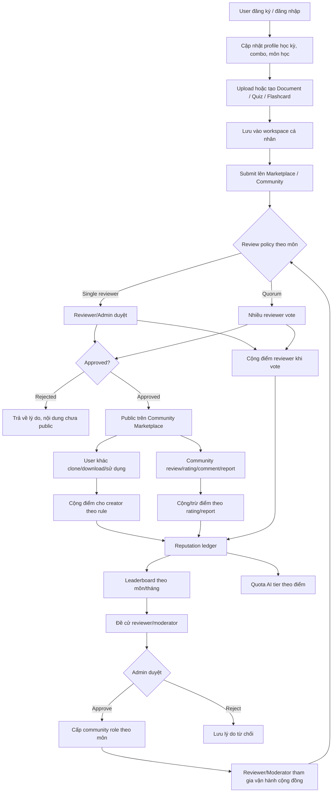

# AI Study Hub - Main Flow Overview

Ngày cập nhật: 22/07/2026  
Phạm vi: tổng quan product flow, backend/frontend flow, reputation, quota AI, leaderboard, nomination và vận hành cộng đồng.

## 1. Tầm nhìn hệ thống

AI Study Hub hướng tới một hệ thống học tập tự duy trì dựa trên đóng góp cộng đồng:

1. User đăng ký tài khoản.
2. User tạo hoặc upload tài liệu, flashcard, quiz.
3. User gửi nội dung lên cộng đồng/marketplace.
4. Reviewer hoặc admin kiểm duyệt nội dung trước khi public.
5. Các user khác clone/download/sử dụng nội dung và đánh giá.
6. Hệ thống cộng/trừ reputation theo hành vi thực tế.
7. Reputation dùng để xếp hạng, tăng uy tín cộng đồng và mở quota AI cao hơn.
8. Top contributor/reviewer theo môn và theo tháng được vinh danh.
9. User đủ điều kiện có thể được đề cử làm reviewer hoặc community moderator.
10. Admin duyệt đề cử, cấu hình luật điểm, quota, giới hạn đề cử và giám sát hệ thống.

Điểm quan trọng hiện tại: reputation đang dùng để xếp hạng, vinh danh, xét quyền cộng đồng và tăng quota AI. Cơ chế "tiêu điểm để unlock tài liệu/tính năng" chưa triển khai và sẽ là phase sau.

## 2. Main Flow End-to-End

## 3. Vai trò và trách nhiệm

| Vai trò | Trách nhiệm chính | Quyền nổi bật |
|---|---|---|
| Guest | Xem landing/login/register | Chưa truy cập workspace |
| Student/User | Học tập, upload/tạo nội dung, clone nội dung, đánh giá, report | Workspace cá nhân, community marketplace, profile reputation/quota |
| Marketplace Reviewer | Kiểm duyệt nội dung marketplace theo môn được cấp | Vote approve/reject nội dung, xem queue reviewer |
| Community Moderator | Quản lý report và nhóm nội dung theo môn | Xử lý report, ẩn/khôi phục nội dung, hỗ trợ kiểm duyệt cộng đồng |
| Admin | Vận hành toàn hệ thống | Quản lý user, role, marketplace, report, reward rules, quota tiers, nominations, system configs |

Role hệ thống `users.role` chỉ có `STUDENT`, `REVIEWER`, `ADMIN`.  
Quyền cộng đồng chi tiết dùng `community_roles`, ví dụ `MARKETPLACE_REVIEWER`, `CONTENT_MODERATOR`, `SUBJECT_MODERATOR`, scope `SUBJECT` hoặc `GLOBAL`.

## 4. Content Lifecycle

### 4.1. Tạo nội dung

Nguồn nội dung:

- Document: upload file, chunking, embedding, summary/chat theo tài liệu.
- Quiz: tạo quiz thủ công hoặc sinh bằng AI.
- Flashcard deck: tạo thủ công hoặc sinh bằng AI.

Trạng thái ban đầu:

- `visibility = PRIVATE` hoặc workspace/private tương ứng.
- `marketStatus = NONE`.
- Nội dung thuộc owner hiện tại.
- Có thể gắn subject/semester/combo để phục vụ lọc và reviewer theo môn.

### 4.2. Submit marketplace

Khi user muốn đăng lên cộng đồng:

1. Frontend gọi API publish/submit marketplace đúng loại nội dung.
2. Backend đổi `visibility` hoặc `marketStatus` sang trạng thái chờ duyệt.
3. Nội dung vào reviewer queue/admin marketplace tab.
4. Reviewer/admin đánh giá theo policy của môn.

### 4.3. Review marketplace

Policy review theo subject:

| Mode | Cách hoạt động | Khi dùng |
|---|---|---|
| `SINGLE_REVIEWER` | Một reviewer/admin hợp lệ duyệt hoặc từ chối | MVP, môn ít reviewer |
| `QUORUM` | Nhiều reviewer vote, approve theo số vote và tỷ lệ cấu hình | Môn lớn, cần đánh giá chéo |

Nguyên tắc chống gian lận:

- Owner không nên tự duyệt nội dung của mình nếu không phải admin.
- Reviewer chỉ duyệt trong scope môn được cấp.
- Vote/review cần audit log.
- Admin có quyền override trong trường hợp cần vận hành.

### 4.4. Public marketplace

Khi approved:

- Nội dung xuất hiện ở Community Marketplace.
- User khác có thể clone/download về workspace.
- Creator bắt đầu nhận điểm theo rule approved/download/review.
- Nội dung được đưa vào ranking/trending/top rated.

Khi rejected:

- Nội dung không public.
- Lưu lý do reject để owner chỉnh sửa.
- Có thể resubmit sau khi sửa, nếu product cho phép.

## 5. Community Usage Flow

Sau khi nội dung public:

1. User khác tìm kiếm theo keyword, loại nội dung, môn, học kỳ.
2. User mở detail và xem review/rating/comment.
3. User clone/download nội dung về workspace cá nhân.
4. User học bằng tài liệu/quiz/flashcard đã clone.
5. User đánh giá chất lượng nội dung.
6. User report nếu nội dung sai, spam, vi phạm, hoặc chất lượng thấp.

Kết quả cộng đồng tạo ra vòng lặp:

- Nội dung tốt có nhiều clone/download và review cao sẽ giúp creator tăng reputation.
- Nội dung kém hoặc bị report đúng sẽ khiến creator bị trừ reputation.
- Reviewer đánh giá tốt, nhất quán với consensus sẽ tăng điểm reviewer.
- User report đúng cũng được cộng điểm; report sai có thể bị trừ điểm.

## 6. Reputation System

Reputation là điểm uy tín của user, hiện dùng cho:

- Xếp hạng contributor/reviewer.
- Vinh danh theo môn/tháng.
- Xét điều kiện đề cử reviewer/moderator.
- Tăng quota AI theo tier.
- Tạo tín hiệu uy tín trong cộng đồng.

Reputation không phải currency để tiêu ở phase hiện tại.

### 6.1. Reputation ledger

Mọi cộng/trừ điểm nên đi qua ledger `reputation_events`.

Ledger giúp:

- Audit vì sao user tăng/giảm điểm.
- Tính leaderboard theo subject và period.
- Chống cộng điểm trùng.
- Tính đề cử monthly top contributor/reviewer.
- Hiển thị lịch sử điểm trên profile.

Các field chính:

| Field | Ý nghĩa |
|---|---|
| `userId` | User nhận cộng/trừ điểm |
| `subjectId` | Môn liên quan, dùng cho leaderboard/nomination |
| `eventType` | Loại event cộng/trừ điểm |
| `targetType`, `targetId` | Nội dung bị tác động: document/quiz/flashcard/report/review |
| `sourceType`, `sourceId` | Nguồn tạo event, ví dụ review/report/clone |
| `pointsDelta` | Số điểm cộng hoặc trừ |
| `reason` | Lý do ngắn |
| `periodKey` | Kỳ tính điểm, format `yyyy-MM` |
| `createdAt` | Thời điểm phát sinh |

### 6.2. Reward rules

Admin cấu hình rule tại `/admin/reputation`, tab `Điểm thưởng`.

Mỗi rule gồm:

| Field | Ý nghĩa |
|---|---|
| `eventType` | Loại event |
| `pointsDelta` | Điểm cộng/trừ |
| `enabled` | Bật/tắt rule |
| `maxEventsPerUserPerPeriod` | Giới hạn số lần tính điểm/user/kỳ |
| `thresholdValue` | Ngưỡng nghiệp vụ, ví dụ mốc download |
| `minRating`, `maxRating` | Khoảng rating áp dụng |
| `description` | Mô tả cho admin |

### 6.3. Event catalog

| Event type | Người nhận điểm | Ý nghĩa |
|---|---|---|
| `CONTENT_APPROVED_DOCUMENT` | Creator | Document được duyệt lên marketplace |
| `CONTENT_APPROVED_QUIZ` | Creator | Quiz được duyệt lên marketplace |
| `CONTENT_APPROVED_FLASHCARD_DECK` | Creator | Flashcard deck được duyệt lên marketplace |
| `MARKETPLACE_CLONE_RECEIVED` | Creator | Nội dung có lượt clone/download từ user khác |
| `CONTENT_DOWNLOAD_MILESTONE` | Creator | Nội dung đạt mốc download do admin cấu hình |
| `COMMUNITY_REVIEW_GOOD` | Creator | Nội dung nhận review/rating tốt |
| `COMMUNITY_REVIEW_BAD` | Creator | Nội dung bị review/rating thấp |
| `REVIEWER_MARKETPLACE_VOTE` | Reviewer | Reviewer hoàn thành vote marketplace |
| `REVIEWER_DECISION_ALIGNED` | Reviewer | Vote của reviewer khớp consensus/final decision |
| `CONTENT_REPORT_ACCEPTED` | Reporter | Report được xử lý là hợp lệ |
| `CONTENT_REPORT_REJECTED` | Reporter | Report bị bác |
| `CONTENT_REPORT_OWNER_PENALTY` | Owner | Nội dung bị report hợp lệ |
| `CONTENT_HIDDEN_PENALTY` | Owner | Nội dung bị ẩn do vi phạm/chất lượng thấp |

## 7. AI Quota Theo Reputation

AI quota được tính theo tier dựa trên `reputationPoints`.

Admin cấu hình tại `/admin/reputation`, tab `Quota AI`.

Mỗi tier gồm:

| Field | Ý nghĩa |
|---|---|
| `name` | Tên tier, ví dụ Bronze/Silver/Gold |
| `minReputationPoints` | Điểm tối thiểu để vào tier |
| `dailyChatLimit`, `monthlyChatLimit` | Quota chat ngày/tháng |
| `dailySummaryLimit`, `monthlySummaryLimit` | Quota summary ngày/tháng |
| `dailyGenerationLimit`, `monthlyGenerationLimit` | Quota sinh quiz/flashcard ngày/tháng |
| `enabled` | Bật/tắt tier |

User xem quota ở Profile:

- Tier hiện tại.
- Reputation hiện tại.
- Used/limit theo ngày và tháng.
- Trạng thái available/limited cho chat, summary, generation.

## 8. Leaderboard và Vinh Danh

Hệ thống cần có leaderboard rõ ràng theo hạng mục:

| Leaderboard | API | Scope | Ý nghĩa |
|---|---|---|---|
| Top contributor | `GET /api/community/leaderboard/reputation/contributors` | Theo subject và period `yyyy-MM` | Vinh danh người đóng góp nội dung/chất lượng cộng đồng |
| Top reviewer | `GET /api/community/leaderboard/reputation/reviewers` | Theo subject và period `yyyy-MM` | Vinh danh reviewer hoạt động tốt |
| Contributor legacy/global | `GET /api/community/leaderboard/contributors` | Toàn hệ thống | Leaderboard cũ, có thể giữ cho dashboard hoặc badge legacy |

Frontend Community page cần hỗ trợ:

- Chọn tab `Leaderboard`.
- Chọn subject hoặc tất cả môn.
- Chọn tháng.
- Chọn hạng mục `Contributor` hoặc `Reviewer`.
- Hiển thị rank, avatar, user, score, event count.

### 8.1. Top theo môn

Mục tiêu product:

- Top 1 mỗi môn hoặc top N mỗi môn được đề cử thăng hạng.
- `N` do admin cấu hình.
- Backend config liên quan:
  - `COMMUNITY_MODERATOR_NOMINATION_LIMIT_PER_SUBJECT`
  - `COMMUNITY_REVIEWER_ELIGIBLE_POINTS`
  - `COMMUNITY_REVIEWER_NOMINATION_LIMIT_PER_SUBJECT`

## 9. Nomination và Promotion Flow

Promotion không tự động cấp quyền ngay. Hệ thống chỉ tạo đề cử, admin phải duyệt.

### 9.1. Monthly top contributor -> Community Moderator

Flow:

1. Cuối tháng, scheduler hoặc admin generate nomination cho period `yyyy-MM`.
2. Backend tính top contributor theo từng subject.
3. Tạo nomination type `MONTHLY_TOP_CONTRIBUTOR`.
4. Role đề cử thường là `CONTENT_MODERATOR` hoặc `SUBJECT_MODERATOR`.
5. Admin xem danh sách đề cử.
6. Admin approve hoặc reject.
7. Nếu approve, backend cấp `community_roles` theo subject và thời hạn hiệu lực.

### 9.2. Reviewer unlock

Reviewer có thể đến từ hai nguồn:

| Nguồn | Cách tạo |
|---|---|
| Đủ điểm tự unlock nomination | Backend tạo nomination khi user đạt điểm/điều kiện |
| Admin chọn thủ công | Admin tạo reviewer nomination cho user và subject |

Điểm bắt buộc: dù đủ điểm, user vẫn phải được admin duyệt mới có quyền reviewer để tránh gian lận điểm.

### 9.3. Nomination statuses

| Status | Ý nghĩa |
|---|---|
| `PENDING` | Chờ admin duyệt |
| `APPROVED` | Đã duyệt và cấp quyền |
| `REJECTED` | Bị từ chối, lưu note |

Admin UI cần có:

- Filter period, subject, status, nomination type.
- Generate monthly nominations.
- Manual reviewer nomination.
- Approve/reject nomination.
- Set effective start/end date.
- Review note.

## 10. Admin Operations

Admin cần vận hành các nhóm chức năng:

| Khu vực admin | Mục tiêu |
|---|---|
| Users | Quản lý user, active/inactive, role hệ thống |
| Roles | Cấp/thu hồi community role thủ công |
| Marketplace | Duyệt nội dung, quản lý policy review theo môn |
| Reports | Xử lý report, ẩn/khôi phục nội dung, xử phạt |
| Badges | Tạo/gán badge |
| Reputation & Quota | Cấu hình reward rules, quota tiers, nominations |
| System Configs | Cấu hình tham số hệ thống |
| Logs/Feedbacks | Audit và phản hồi |

## 11. Backend API Map

### 11.1. User reputation/quota

| API | Mục đích |
|---|---|
| `GET /api/users/me/ai-quota` | User xem quota AI hiện tại theo reputation tier |
| `GET /api/users/me/reputation/events` | User xem ledger cộng/trừ điểm |

### 11.2. Community leaderboard

| API | Mục đích |
|---|---|
| `GET /api/community/leaderboard/reputation/contributors` | Top contributor theo subject/period |
| `GET /api/community/leaderboard/reputation/reviewers` | Top reviewer theo subject/period |

Query phổ biến:

- `subjectId`
- `periodKey`
- `page`
- `size`

### 11.3. Admin reward rules

| API | Mục đích |
|---|---|
| `GET /api/admin/reward-rules` | Xem toàn bộ rule cộng/trừ điểm |
| `PUT /api/admin/reward-rules/{eventType}` | Cập nhật rule theo event type |

### 11.4. Admin AI quota tiers

| API | Mục đích |
|---|---|
| `GET /api/admin/ai-quota-tiers` | Xem danh sách quota tiers |
| `POST /api/admin/ai-quota-tiers` | Tạo quota tier |
| `PUT /api/admin/ai-quota-tiers/{id}` | Cập nhật quota tier |
| `DELETE /api/admin/ai-quota-tiers/{id}` | Xóa quota tier |

### 11.5. Admin nominations

| API | Mục đích |
|---|---|
| `POST /api/admin/community-role-nominations/generate-monthly` | Tạo đề cử top tháng |
| `POST /api/admin/community-role-nominations/reviewers` | Tạo đề cử reviewer thủ công |
| `GET /api/admin/community-role-nominations` | Xem/filter danh sách đề cử |
| `PATCH /api/admin/community-role-nominations/{id}/approve` | Duyệt đề cử và cấp quyền |
| `PATCH /api/admin/community-role-nominations/{id}/reject` | Từ chối đề cử |

## 12. Frontend Screen Map

| Screen | Flow được phục vụ |
|---|---|
| Register/Login | Bắt đầu tài khoản |
| Dashboard | Tổng quan học tập, leaderboard/widget nếu cần |
| Documents | Upload, chunking, quản lý tài liệu |
| Quiz | Tạo/làm quiz |
| Flashcards | Tạo/học flashcard |
| Community | Marketplace, clone/download, leaderboard contributor/reviewer |
| Reviewer | Queue kiểm duyệt marketplace |
| Profile | Reputation, quota AI, badges, activity, referral |
| Admin Marketplace | Review policy và quản lý nội dung marketplace |
| Admin Reports | Xử lý report/vi phạm |
| Admin Roles | Cấp role cộng đồng thủ công |
| Admin Reputation & Quota | Reward rules, quota tiers, nomination approval |
| Admin System Configs | Cấu hình tham số hệ thống |

## 13. Trạng thái hoàn thiện so với main flow

| Flow | Trạng thái | Ghi chú |
|---|---|---|
| Đăng ký/đăng nhập | Đã có | Auth/profile đã có |
| Upload/tạo document/quiz/flashcard | Đã có | Cần tiếp tục hardening UX và error handling |
| Publish lên community/marketplace | Đã có | Frontend đã được chỉnh API document publish trước đó |
| Reviewer/admin duyệt marketplace | Đã có | Có reviewer page/admin marketplace/policy |
| User clone/download sử dụng | Đã có | Marketplace clone service đã tích hợp điểm |
| Community review/rating/report | Đã có nền | Cần hoàn thiện UX chống spam/collusion nếu muốn production-grade |
| Reputation cộng/trừ theo event | Đã có backend core | Có ledger và reward rules admin chỉnh được |
| Leaderboard top contributor/reviewer theo môn/tháng | Đã có backend + frontend community | Cần thêm pagination/empty analytics nếu dữ liệu lớn |
| Quota AI theo điểm | Đã có backend + profile/admin UI | Cần kiểm tra toàn bộ AI entrypoints đã gọi quota guard |
| Nomination reviewer/moderator | Đã có backend + admin UI | Promotion cần admin approve |
| Admin giám sát/vận hành | Đã có nhiều tab | Cần thêm dashboard cảnh báo gian lận/chất lượng |
| Tiêu điểm để unlock tài liệu/tính năng | Chưa làm | Phase sau theo yêu cầu product |

## 14. Các cải tiến nên làm tiếp

### 14.1. Product/UX

1. Thêm notification cho:
   - Nội dung được duyệt/từ chối.
   - Được cộng/trừ điểm.
   - Được đề cử reviewer/moderator.
   - Đề cử được approve/reject.
2. Thêm trang public profile/community profile:
   - Reputation.
   - Badge.
   - Top môn.
   - Nội dung đã đóng góp.
   - Review history public ở mức phù hợp.
3. Thêm trang leaderboard chuyên sâu:
   - Filter subject, month, role, content type.
   - Export/report cho admin.
4. Hiển thị lý do cộng/trừ điểm thân thiện hơn thay vì chỉ event type.

### 14.2. Anti-gaming

1. Chống clone/download tự tạo điểm:
   - Không tính điểm nếu clone chính nội dung của mình.
   - Rate limit clone/download score.
   - Unique scoring theo user-source-target.
2. Chống review vòng tròn:
   - Phát hiện cụm user review chéo bất thường.
   - Giới hạn điểm review cùng một owner.
3. Chống report spam:
   - Trừ điểm report sai.
   - Rate limit report.
   - Flag user có tỷ lệ report sai cao.
4. Reviewer quality:
   - Tính alignment với final decision.
   - Giảm điểm reviewer nếu thường xuyên lệch consensus.
   - Audit admin override.

### 14.3. Backend

1. Đảm bảo toàn bộ AI entrypoints đều kiểm tra quota:
   - Chat.
   - Summary.
   - Quiz generation.
   - Flashcard generation.
   - Document chunking/embedding nếu tính quota riêng.
2. Bổ sung scheduled job/report cho monthly nomination:
   - Log kết quả job.
   - Retry nếu fail.
   - Admin xem lịch sử generate.
3. Bổ sung idempotency cho reputation event:
   - Tránh cộng điểm trùng khi retry API.
4. Bổ sung test tích hợp cho:
   - Approved content -> reward event.
   - Good/bad review -> cộng/trừ điểm.
   - Report accepted/rejected -> cộng/trừ điểm.
   - Quota tier selection.
   - Nomination approve -> community role active.

### 14.4. Frontend

1. Admin Reputation tab:
   - Thêm pagination thật cho nominations/rules nếu dữ liệu lớn.
   - Thêm drawer xem chi tiết nomination.
   - Thêm validation min/max rating đẹp hơn.
2. Community page:
   - Tách leaderboard thành component riêng.
   - Thêm sort theo `communityRatingAvg` nếu backend hỗ trợ.
3. Profile page:
   - Map event type sang label tiếng Việt.
   - Thêm biểu đồ điểm theo tháng.
4. Reviewer page:
   - Hiển thị điểm reviewer nhận được sau vote.
   - Hiển thị subject scope rõ ràng.

## 15. Definition of Done cho flow hoàn hảo

Một phiên bản production-ready nên đạt các tiêu chí:

1. User mới có thể đăng ký, upload/tạo ít nhất một loại nội dung và gửi lên marketplace không lỗi.
2. Reviewer/admin có thể duyệt/từ chối nội dung theo subject policy.
3. Nội dung approved xuất hiện trên Community Marketplace và clone/download được.
4. Review/report tạo đúng reputation events và cập nhật `reputationPoints`.
5. User thấy quota AI theo tier và ledger điểm trên Profile.
6. Admin chỉnh reward rules mà không cần sửa code.
7. Admin chỉnh quota tiers mà không cần sửa code.
8. Leaderboard contributor/reviewer lọc được theo subject và month.
9. Monthly nomination tạo đúng top N theo môn.
10. Admin approve nomination thì user nhận community role đúng scope và thời hạn.
11. Có audit log đủ để truy vết điểm, review, report, nomination.
12. Có test backend và build frontend pass trước khi merge.

## 16. Kết luận

Main flow hiện tại đã đi đúng hướng cho mô hình cộng đồng tự duy trì:

- Content tạo giá trị cho marketplace.
- Community sử dụng và đánh giá tạo tín hiệu chất lượng.
- Reputation ledger biến hành vi thành điểm rõ ràng.
- Leaderboard và nomination biến điểm thành uy tín/quyền cộng đồng.
- Admin giữ quyền kiểm soát bằng reward rules, quota tiers, review policy và nomination approval.

Phần còn thiếu lớn nhất cho phase sau là cơ chế tiêu điểm/unlock tài liệu hoặc tính năng, cùng lớp anti-gaming nâng cao để bảo vệ chất lượng cộng đồng khi hệ thống có nhiều người dùng thật.
