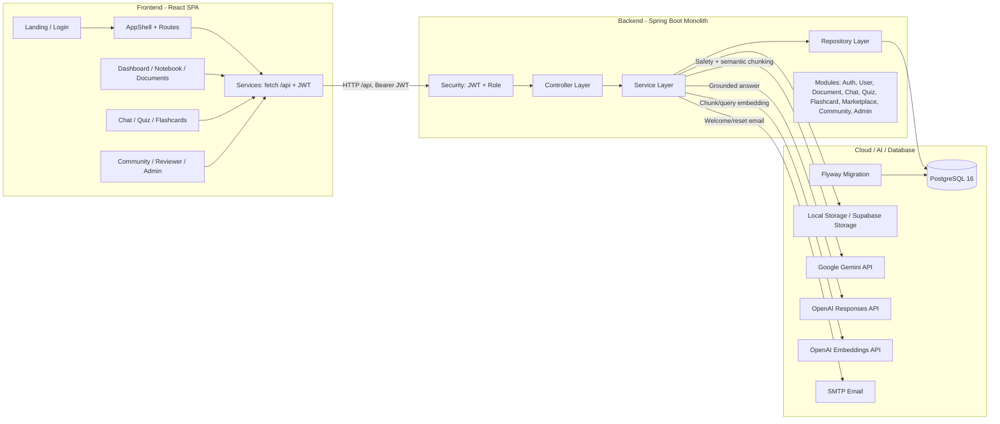
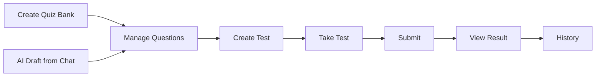
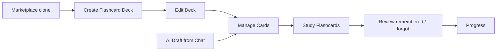
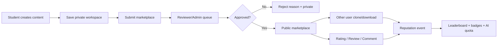
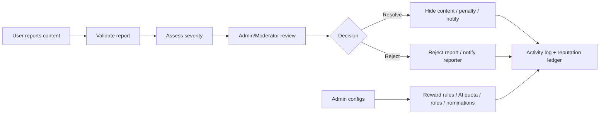

# AI Study Hub

AI Study Hub, còn được đặt tên giao diện là MindSpace, là nền tảng học tập thông minh cho sinh viên. Hệ thống gom tài liệu, notebook, quiz, flashcard, marketplace cộng đồng và trợ lý AI/RAG vào một không gian học tập tập trung.


## Tổng Quan Project

AI Study Hub giải quyết bài toán học tập bị phân mảnh: tài liệu nằm rải rác ở Google Drive, Messenger, Facebook Group, email; sinh viên khó tìm lại đúng nội dung; việc ôn tập phụ thuộc nhiều vào thao tác thủ công; tài liệu cộng đồng thiếu kiểm duyệt và thiếu cơ chế ghi nhận đóng góp.

Repo hiện có 2 ứng dụng chính:

| Phần | Thư mục | Vai trò |
|---|---|---|
| Frontend | `frontend/` | React SPA cho dashboard, notebook, document, chat, quiz, flashcard, community, reviewer, admin |
| Backend | `backend/` | Spring Boot REST API, JWT security, business modules, RAG, marketplace, reputation, admin |
| Tài liệu phân tích | Root repo | API contract, ERD Mermaid, task plan backend, main flow, reward/badge analysis |


## Problem & Solution

### Background Của Dự Án

Sinh viên thường học từ nhiều loại tài liệu: PDF, DOCX, slide PPTX, ghi chú cá nhân, đề ôn tập, quiz và flashcard. Khi khối lượng môn học tăng lên, các vấn đề xuất hiện rõ:

| Hiện trạng | Tác động |
|---|---|
| Tài liệu học tập phân tán ở nhiều nền tảng | Khó tìm lại đúng file, đúng phiên bản, đúng môn |
| File dài, nhiều trang, thiếu công cụ truy vấn nội dung | Sinh viên mất thời gian đọc thủ công và dễ bỏ sót ý chính |
| Quiz/flashcard phải tự tạo bằng tay | Tốn thời gian ôn tập, khó duy trì thói quen học đều |
| Tài liệu cộng đồng chưa có quy trình review | Dễ phát tán tài liệu kém chất lượng, spam hoặc sai nội dung |
| Đóng góp cộng đồng chưa được ghi nhận minh bạch | Người tạo nội dung tốt không có động lực duy trì đóng góp |

### Vấn Đề Cần Giải Quyết

1. Tập trung học liệu cá nhân theo notebook, môn học, học kỳ và combo.
2. Tự động đọc hiểu tài liệu để hỗ trợ hỏi đáp bằng AI có dẫn nguồn.
3. Tạo quiz và flashcard từ tài liệu hoặc từ prompt AI.
4. Tạo marketplace học liệu có kiểm duyệt bởi reviewer/admin.
5. Ghi nhận đóng góp qua badge, reputation, leaderboard và quota AI.
6. Cung cấp công cụ vận hành cho admin: user, role, marketplace, reports, reward rules, AI quota, system configs.

### Giải Pháp Đề Xuất

AI Study Hub đề xuất một nền tảng fullstack gồm:

| Trụ cột | Giải pháp |
|---|---|
| Workspace cá nhân | Notebook, document repository, tag, subject, semester, combo |
| RAG Assistant | Extract text, semantic chunking, embedding, semantic search, answer generation có citation |
| Practice engine | Tạo/làm quiz, lưu test history, flashcard review progress |
| Community marketplace | Submit, reviewer queue, review policy, clone/download, rating/comment/report |
| Governance | Admin moderation, document safety review, content reports, visibility control |
| Growth loop | Reputation ledger, reward rules, badges, referral, leaderboard, AI quota tiers |

## System Architecture

### Logo Công Nghệ

| Frontend | Backend | Cloud / AI / Database |
|---|---|---|
|     |    |      |

### Kiến Trúc Tổng Thể



### Kiến thúc hệ thống

| Phần | Thành phần thật trong source | Trách nhiệm |
|---|---|---|
| Backend | `backend/src/main/java/com/aistudyhub` | REST API, JWT, business logic, RAG, moderation, reputation |
| Frontend | `frontend/src` | SPA, routing, services, UI flow, admin/reviewer/community screens |
| Cloud/AI/Database | PostgreSQL, Flyway, Local/Supabase Storage, Gemini, OpenAI, SMTP | Lưu dữ liệu, lưu file, xử lý AI, gửi email |

## RAG Pipeline

Pipeline RAG hiện tại không dùng vector database chuyên dụng riêng. Embedding được lưu trong bảng `document_chunks.embedding_vector`, sau đó backend tạo query embedding và tính cosine similarity trong Java. Đây là vector store nội bộ trên PostgreSQL, phù hợp MVP/demo; có thể nâng cấp lên `pgvector`, Qdrant, Weaviate hoặc Pinecone.

```mermaid
flowchart LR
    A["1. Upload Document<br/>PDF / DOCX / PPTX / TXT"] --> B["2. Store File<br/>Local hoặc Supabase"]
    B --> C["3. Extract Text<br/>PDFBox / Apache POI / TXT"]
    C --> D["4. Gemini Safety Check<br/>SAFE / REVIEW_REQUIRED / BLOCKED"]
    D --> E{"Decision"}
    E -->|BLOCKED| X["Stop distribution<br/>Disable share link<br/>Notify owner"]
    E -->|REVIEW_REQUIRED| Y["Save chunks<br/>Admin safety review required"]
    E -->|SAFE| F["5. Semantic Chunking<br/>Gemini fallback local heuristic"]
    Y --> F
    F --> G["6. OpenAI Embedding<br/>text-embedding-3-small"]
    G --> H[("7. document_chunks<br/>text + source page + embedding")]
    I["8. User Query"] --> J["9. Query Embedding"]
    J --> K["10. Semantic Search<br/>cosine similarity + topK"]
    H --> K
    K --> L["11. Prompt Building<br/>question + retrieved chunks"]
    L --> M["12. Answer Generation<br/>GPT-4o mini"]
    M --> N["13. Save Chat Message<br/>citations + AI usage log"]
```



### Các Service Chính Của RAG

| Bước | File chính | Ghi chú |
|---|---|---|
| Upload | `DocumentUploadService.java` | Validate file, lưu storage, tạo document, auto process async |
| Extract | `TextExtractionService.java` | PDFBox cho PDF, Apache POI cho DOCX/PPTX, UTF-8 cho TXT |
| Chunking | `GeminiChunkingService.java`, `TextChunkingService.java` | Gemini semantic chunking + local fallback |
| Safety | `DocumentSafetyReviewService.java`, `DocumentSafetyGuard.java` | Chặn hoặc yêu cầu admin review trước khi share/publish |
| Embedding | `OpenAIEmbeddingService.java` | Gọi `/embeddings`, lưu vector JSON vào DB |
| Retrieval | `DocumentChunkService.java` | Query embedding, cosine similarity, fallback keyword overlap |
| Answer | `OpenAIChatAnswerService.java` | Gọi OpenAI Responses API, trả lời tiếng Việt có grounding |
| Chat orchestration | `ChatMessageService.java` | Lưu user/AI message, citation, activity log, quota usage |

## Actors & Main Features

### Actor: Student / User

| Nhóm chức năng | Main Features |
|---|---|
| Account | Register, email verification, login, OAuth Google/GitHub, forgot/reset password, profile |
| Workspace | Tạo notebook, upload document, gắn document vào notebook, tag, filter theo subject |
| AI Learning | Chat với notebook, hỏi đáp theo tài liệu, xem citation, sinh quiz/flashcard từ prompt |
| Practice | Tạo quiz bank, quản lý câu hỏi, làm test theo mode all/selected/random, xem history |
| Flashcard | Tạo deck/card, học flashcard, review remembered/forgot, theo dõi progress |
| Community | Submit marketplace, clone/download học liệu, rating/review/comment/report |
| Growth | Xem badge, reputation events, AI quota, referral code, leaderboard |

### Actor: Marketplace Reviewer

| Nhóm chức năng | Main Features |
|---|---|
| Review queue | Xem danh sách document/quiz/flashcard pending theo quyền và scope |
| Preview content | Xem chi tiết nội dung, metadata, câu hỏi quiz, card flashcard, tài liệu |
| Vote | Approve/reject với review note |
| Policy-aware review | Hỗ trợ `SINGLE_REVIEWER` và `QUORUM` theo subject |
| Reward | Nhận reputation event cho vote, alignment với final decision, badge reviewer |
| Restriction | Không tự duyệt nội dung của chính mình, chỉ duyệt trong scope được cấp |

### Actor: Community Moderator

| Nhóm chức năng | Main Features |
|---|---|
| Report handling | Theo dõi report nội dung sai, spam, vi phạm, chất lượng thấp |
| Moderation | Ẩn/khôi phục content, chuyển report sang resolved/rejected |
| Community health | Duy trì chất lượng marketplace, review comment/report |
| Scope permission | Quyền `CONTENT_MODERATOR` hoặc `SUBJECT_MODERATOR` theo global/subject |
| Audit | Activity log, notification, report history |

Ghi chú source hiện tại: `SecurityConfig` vẫn ưu tiên `/api/admin/**` cho `ADMIN`; một số controller report có ghi chú rằng nếu muốn moderator không phải admin truy cập admin route thì cần tinh chỉnh security route/authority.

### Actor: Admin

| Nhóm chức năng | Main Features |
|---|---|
| User management | Search user, active/inactive, role system `STUDENT`/`ADMIN`, badge manual assign |
| Academic master data | Semester, subject, combo, combo-subject |
| Marketplace operation | Duyệt/reject override, review policy theo subject, pending queue |
| Governance | Preview content, warn owner, hide/restore content, document safety reviews |
| Community roles | Cấp/thu hồi reviewer/moderator theo scope |
| Reward system | Cấu hình reward rules, AI quota tiers, nominations |
| System operation | System configs, feedback, notifications, activity logs, AI usage analytics |

## Main Flows

Mỗi flow khi demo nên có 2 người phối hợp: một người trình bày nghiệp vụ, một người thao tác trực tiếp trên máy. Người trình bày nói mục tiêu, actor, expected result; người thao tác chỉ click theo kịch bản và dừng ở các màn hình có điểm nhấn.

### Main Flow 1: Document Processing & RAG Chat

```mermaid
flowchart LR
    A["Student login"] --> B["Create notebook / choose subject"]
    B --> C["Upload PDF/DOCX/PPTX/TXT"]
    C --> D["Store file + create Document"]
    D --> E["Auto process async"]
    E --> F["Extract text"]
    F --> G["Safety review + chunking"]
    G --> H["Generate embeddings"]
    H --> I["Document READY"]
    I --> J["Open chat session"]
    J --> K["Ask question"]
    K --> L["Retrieve topK chunks"]
    L --> M["Generate answer + citations"]
```



Demo trực tiếp:

| Vai trò demo | Nội dung |
|---|---|
| Người trình bày | Giải thích vì sao tài liệu dài được biến thành tri thức truy vấn được |
| Người thao tác | Login, upload file, mở document status/chunks, vào notebook chat, hỏi một câu về tài liệu |
| Điểm nhấn | Citation theo document/chunk/page, quota AI log, fallback nếu thiếu context |

### Main Flow 2: Quiz Feature Flow



Main steps:

| Step | Feature |
|---|---|
| 1 | Tạo quiz thủ công hoặc import draft do AI sinh từ chat |
| 2 | Thêm/sửa/xóa câu hỏi, option, explanation |
| 3 | Tạo test với mode `ALL`, `SELECTED`, `RANDOM`, timer, shuffle |
| 4 | Lưu câu trả lời từng câu, submit bài |
| 5 | Xem điểm, câu đúng/sai, explanation, lịch sử làm bài |

Demo trực tiếp:

| Vai trò demo | Nội dung |
|---|---|
| Người trình bày | Nói quiz giúp chuyển tài liệu thành practice có chấm điểm |
| Người thao tác | Mở Quiz, tạo quiz hoặc dùng AI draft, start test, submit, xem result/history |

### Main Flow 3: Flashcard Feature Flow



Main steps:

| Step | Feature |
|---|---|
| 1 | Tạo deck theo subject/notebook hoặc clone từ marketplace |
| 2 | Thêm/sửa/xóa card front/back |
| 3 | Sinh flashcard bằng AI từ document/chat draft |
| 4 | Học flashcard, đánh dấu remembered/forgot |
| 5 | Cập nhật progress, due cards, box level |

Demo trực tiếp:

| Vai trò demo | Nội dung |
|---|---|
| Người trình bày | Giải thích flashcard hỗ trợ ghi nhớ ngắn hạn và ôn tập lặp lại |
| Người thao tác | Tạo deck, thêm card, học thử vài card, xem progress |

### Main Flow 4: Marketplace & Community Flow



Main steps:

| Step | Feature |
|---|---|
| 1 | Owner submit document/quiz/flashcard với note |
| 2 | Backend set `visibility=MARKETPLACE`, `marketStatus=PENDING` |
| 3 | Reviewer hoặc admin approve/reject theo policy |
| 4 | Approved content public trên community/marketplace |
| 5 | User khác clone/download về workspace cá nhân |
| 6 | Review/rating/report tạo tín hiệu chất lượng và reputation |

Demo trực tiếp:

| Vai trò demo | Nội dung |
|---|---|
| Người trình bày | Nói vòng lặp cộng đồng: đóng góp -> kiểm duyệt -> sử dụng -> điểm uy tín |
| Người thao tác | Submit một nội dung, đổi sang reviewer/admin duyệt, quay lại community clone/rating |

###  Main Flow 5: Report, Moderation & Admin Operation



Main steps:

| Step | Feature |
|---|---|
| 1 | User gửi report với target type, target id, reason, details |
| 2 | Backend chặn duplicate/pending report và phân loại severity |
| 3 | Admin xem report queue, preview nội dung |
| 4 | Admin resolve hoặc reject, có thể hide/restore content |
| 5 | Reputation event, notification và activity log được ghi nhận |
| 6 | Admin tinh chỉnh reward rules, quota tiers, system configs để vận hành lâu dài |

Demo trực tiếp:

| Vai trò demo | Nội dung |
|---|---|
| Người trình bày | Nhấn mạnh hệ thống không chỉ tạo nội dung mà còn kiểm soát chất lượng |
| Người thao tác | Report một content, mở Admin Reports/Governance, xử lý report, xem notification/log |

## Team Contribution

Repo không chứa tên cá nhân của từng thành viên, nên bảng dưới tổng hợp theo phân công module đang thể hiện trong tài liệu backend và cấu trúc source. Khi đưa vào slide chính thức, thay `FE`, `BE1`, `BE2`, `BE3`, `QA/Integration` bằng tên thành viên thật.

| Thành viên / Nhóm | Đóng góp chính | File/module đại diện |
|---|---|---|
| FE | Xây dựng React SPA, routing, AppShell, dashboard, documents, chat, quiz, flashcards, community, reviewer, admin UI | `frontend/src/App.tsx`, `frontend/src/pages`, `frontend/src/services` |
| BE1 - Foundation/RAG Core | Spring foundation, JWT security, common response/error, auth/user, system config, RAG core, quota/logging, permission control | `config/`, `security/`, `module/auth`, `module/user`, `module/document/service/DocumentChunkService.java` |
| BE2 - Workspace/Document | Academic data, notebook, document metadata/upload, storage local/Supabase, tags, notebook-document mapping | `module/academic`, `module/notebook`, `module/document`, `module/tag` |
| BE3 - Practice/Community | Quiz/test, flashcard, marketplace, reviewer flow, governance, community, report, badge/reputation/referral | `module/quiz`, `module/flashcard`, `module/marketplace`, `module/community`, `module/reputation` |
| QA/Integration | API contract, Swagger/OpenAPI, H2 tests, main flow documentation, ERD, demo scenario | `ai_study_hub_mock_openapi_contract.json`, `ERD-Final-Ver1.mmd`, `backend/src/test`, `MAIN_FLOW_OVERVIEW.md` |

### Khó Khăn / Lỗi Gặp Phải Và Cách Khắc Phục

| Khó khăn | Biểu hiện | Cách khắc phục trong project |
|---|---|---|
| Tích hợp frontend-backend | API trả rỗng/HTML khi backend down, token hết hạn, proxy khác port | Service frontend dùng `/api`, Vite proxy sang `localhost:8080`, `safeParseJson`, tự clear token khi 401 |
| RAG dễ fail vì file/AI | File không extract được, Gemini thiếu key/rate limit, chunk quá nhiều | Validate file type/size, PDFBox/POI extraction, Gemini retry/semaphore, local heuristic fallback, max chunks |
| Kiểm duyệt tài liệu | Tài liệu có rủi ro vẫn có thể bị share/publish | Gemini safety review, `REVIEW_REQUIRED`, `BLOCKED`, disable share link, admin safety review |
| Embedding/search MVP | Chưa có vector DB chuyên dụng | Lưu embedding JSON trong `document_chunks`, query embedding + cosine similarity trong service, ghi rõ hướng nâng cấp |
| Quyền reviewer/moderator phức tạp | Role hệ thống khác community role theo scope | `CommunityPermissionService`, `community_roles`, CustomUserDetails tự thêm authority reviewer/moderator khi active |
| Marketplace dễ bị spam/gian lận | Clone trùng, reviewer tự duyệt, report lặp | Clone receipt/lock, reviewer không vote content của mình, duplicate pending report guard, reward rule limits |
| Reputation/badge dễ trùng điểm | Retry API hoặc gọi lại flow có thể cộng điểm nhiều lần | Reputation ledger, idempotency key trong reward event, unique user-badge |

## Future Improvements

### Hạn Chế Hiện Tại

| Hạn chế | Ảnh hưởng |
|---|---|
| Vector search đang chạy trong service bằng embedding JSON + cosine | Khó scale khi số chunk lớn, chưa có ANN index |
| Một số admin route chưa mở rõ cho community moderator không phải admin | Moderator scope có thể chưa vận hành trọn vẹn nếu không chỉnh security |
| Một số service frontend legacy còn mock fallback | Dễ nhầm trạng thái thật/giả nếu demo không kiểm soát data |
| Badge/reputation một số flow còn phụ thuộc thời điểm leaderboard chạy | Trải nghiệm real-time reward chưa hoàn chỉnh |
| AI quota cần kiểm tra phủ hết mọi entrypoint | Có nguy cơ một số tác vụ AI chưa đi qua quota guard |
| Chống gian lận cộng đồng mới ở mức nền | Chưa có phân tích collusion, review vòng tròn, report abuse nâng cao |

### Điểm Yếu Của Hệ Thống

1. RAG phụ thuộc chất lượng text extraction; file scan ảnh chưa có OCR thật.
2. Không có job queue chuyên dụng cho document processing; hiện dùng async + semaphore trong app.
3. Embedding lưu dạng `TEXT` khiến truy vấn vector không tối ưu.
4. Observability còn mỏng: chưa có dashboard metrics, tracing, alerting.
5. Cơ chế moderation/reward cần thêm kiểm thử tích hợp khi dữ liệu lớn và nhiều actor.

### Hướng Phát Triển Và Cải Tiến

| Hướng cải tiến | Đề xuất triển khai |
|---|---|
| Vector DB production | Dùng `pgvector` trước, sau đó cân nhắc Qdrant/Weaviate/Pinecone cho ANN search + metadata filter |
| OCR pipeline | Thêm OCR cho PDF scan/image, lưu page text và confidence |
| Background jobs | Tách document processing sang queue worker, retry, dead-letter, dashboard job status |
| Streaming chat | Trả answer dạng streaming, hiển thị citation song song |
| Anti-gaming | Unique scoring theo actor-target-period, phát hiện review vòng tròn, rate limit clone/report/review |
| Reward real-time | Gọi reward/badge event ngay tại approve/download/review, notification khi nhận badge |
| Moderator access | Chuẩn hóa authority cho `/api/admin/reports` hoặc tách route moderator riêng |
| Testing/CI | Thêm integration tests cho marketplace, reputation, quota, RAG; GitHub Actions build FE/BE |
| Observability | Log correlation id, metrics AI cost/token, admin dashboard cảnh báo |
| Deployment | Dockerize backend/frontend, reverse proxy, secrets management, migration pipeline |

## Tech Stack

### Frontend

| Công nghệ | Vai trò |
|---|---|
| React 19 + TypeScript 5.6 | Xây dựng SPA typed UI |
| Vite 8 | Dev server, build, proxy `/api` sang backend |
| React Router DOM 7 | Routing public/authenticated/admin/reviewer |
| TanStack React Query | Data fetching/cache ở một số hook |
| Zustand | Auth store và state nhẹ |
| Tailwind CSS 4 + shadcn/Radix/MUI | UI system và component primitives |
| Framer Motion, GSAP, Three.js, Spline, Rive/Lottie | Animation, 3D, mascot, landing/dashboard effects |
| Recharts | Biểu đồ dashboard/profile |
| Sonner/Notiflix | Toast/notification UI |

### Backend

| Công nghệ | Vai trò |
|---|---|
| Java 17 | Runtime chính |
| Spring Boot 3.5.15 | REST API application |
| Spring Security 6 + JJWT 0.12 | Stateless JWT auth |
| Spring Data JPA + Hibernate | ORM/repository |
| PostgreSQL 16 | Database chính |
| Flyway | Migration schema |
| Springdoc OpenAPI | Swagger UI/API docs |
| Spring WebFlux WebClient | Gọi OpenAI/Gemini/Supabase |
| PDFBox + Apache POI | Extract text PDF/DOCX/PPTX |
| Lombok | Giảm boilerplate DTO/entity/service |
| H2 + Spring Security Test | Test profile |

### Cloud / AI / Storage

| Thành phần | Vai trò |
|---|---|
| Local Storage | Storage mặc định cho dev, thư mục `uploads` |
| Supabase Storage | Storage cloud tùy chọn khi `app.storage.type=supabase` |
| Google Gemini | Safety review và semantic chunking |
| OpenAI Embeddings | Sinh embedding chunk/query với `text-embedding-3-small` |
| OpenAI Responses | Sinh câu trả lời chat với `gpt-4o-mini` |
| SMTP | Welcome email, reset password, verification |

## Module Map

### Backend Modules

| Module | Trách nhiệm chính |
|---|---|
| `auth` | Register, verify email, login JWT, reset password, OAuth |
| `user` | Profile, capabilities, change password |
| `academic` | Semester, subject, combo |
| `notebook` | Workspace notebook CRUD |
| `document` | Metadata, upload, storage, chunking, share link, safety review |
| `chat` | Chat session/message, RAG answer, AI quiz/flashcard draft import |
| `quiz` | Quiz CRUD, question/option, test start/answer/submit/history |
| `flashcard` | Deck/card CRUD, due cards, review progress, AI import |
| `marketplace` | Submit, browse/search, clone, reviewer vote, review policy |
| `community` | Community documents, reviews, comments, reports, leaderboard, referral, roles |
| `reputation` | Reward rules, reputation ledger, AI quota tiers, nominations |
| `badge` | Badge catalog, user badges, admin assign |
| `governance` | Admin preview/warn governance |
| `notification` | User notifications |
| `feedback` | User/system feedback and admin processing |
| `activitylog` | User/admin activity logs |
| `AiUsageLogs` | AI usage analytics and quota tracking |
| `systemconfig` | Public/admin runtime config |
| `admin` | User/content/admin health APIs |

### Frontend Screens

| Route | Screen |
|---|---|
| `/` | Landing page |
| `/login`, `/reset-password`, `/oauth/:provider/callback` | Auth panel |
| `/dashboard` | Dashboard overview |
| `/notebooks`, `/notebooks/:id` | Notebook list/detail |
| `/documents` | Workspace documents |
| `/share/documents/:token` | Public document share |
| `/chat` | Chat assistant |
| `/quiz`, `/quiz/history` | Quiz bank/practice history |
| `/flashcards` | Flashcard decks/study |
| `/community` | Marketplace/community |
| `/reviewer`, `/reviewer/documents/:id` | Reviewer queue/preview |
| `/profile`, `/badges`, `/notifications`, `/my-reports` | Personal account/community status |
| `/admin/:tab` | Admin overview/users/academic/marketplace/reports/reputation/roles/config/logs |

## Database & API

### Core Data Groups

| Nhóm bảng | Bảng tiêu biểu |
|---|---|
| User/account | `users`, `password_resets`, `registration_verifications`, `notifications` |
| Academic | `semesters`, `subjects`, `combos`, `combo_subjects` |
| Workspace | `notebooks`, `documents`, `notebook_documents`, `tags`, `document_tags` |
| RAG | `document_chunks`, embedding fields, source page/section |
| Chat | `chat_sessions`, `chat_messages` |
| Practice | `quizzes`, `quiz_questions`, `quiz_options`, `tests`, `user_quiz_progress`, `flashcard_decks`, `flashcards`, `user_flashcard_progress` |
| Marketplace/community | `marketplace_submissions`, `market_reviews`, `community_comments`, `content_reports`, clone receipts |
| Growth/governance | `badges`, `user_badges`, `reputation_events`, `reward_rules`, `ai_quota_tiers`, `community_roles`, nominations, activity logs |
| System | `system_configs`, `system_feedbacks`, `ai_usage_logs` |

### API Response Chuẩn

Success:

```json
{
  "success": true,
  "message": "Success",
  "data": {}
}
```

Error:

```json
{
  "success": false,
  "message": "Email already exists",
  "errorCode": "EMAIL_ALREADY_EXISTS"
}
```

Pagination:

```json
{
  "success": true,
  "message": "Success",
  "data": {
    "items": [],
    "page": 0,
    "size": 10,
    "totalElements": 100,
    "totalPages": 10
  }
}
```

### API Nhóm Chính

| Nhóm | Endpoint tiêu biểu |
|---|---|
| Auth | `POST /api/auth/register`, `POST /api/auth/login`, `POST /api/auth/verify-registration` |
| User | `GET /api/users/me`, `GET /api/users/me/capabilities`, `GET /api/users/me/ai-quota` |
| Document | `POST /api/documents/upload`, `GET /api/documents`, `POST /api/documents/{id}/process` |
| Chat | `POST /api/notebooks/{notebookId}/chat-sessions`, `POST /api/chat-sessions/{sessionId}/messages` |
| Quiz | `POST /api/quizzes`, `POST /api/quizzes/{quizId}/tests`, `POST /api/tests/{testId}/submit` |
| Flashcard | `POST /api/flashcard-decks`, `POST /api/flashcards/{cardId}/review` |
| Marketplace | `POST /api/marketplace/documents/{id}/submit`, `GET /api/marketplace/search`, `POST /api/marketplace/quizzes/{id}/clone` |
| Reviewer | `GET /api/reviewer/marketplace/pending`, `POST /api/reviewer/marketplace/{targetType}/{targetId}/vote` |
| Community | `GET /api/community/documents`, `POST /api/community/reviews`, `POST /api/reports` |
| Admin | `GET /api/admin/users`, `GET /api/admin/reports`, `GET /api/admin/reward-rules`, `GET /api/admin/ai-quota-tiers` |

Swagger UI khi backend chạy:

```text
http://localhost:8080/swagger-ui.html
```

## Local Setup

### Prerequisites

| Tool | Version khuyến nghị |
|---|---|
| JDK | 17+ |
| Maven | 3.8+ |
| Node.js | 20+ |
| npm | Theo Node |
| Docker | Có Docker Compose |

### 1. Chạy PostgreSQL

```bash
cd backend
docker compose up -d postgres
```

Database mặc định trong `backend/docker-compose.yml`:

```text
POSTGRES_DB=ai_study_hub
POSTGRES_USER=aistudyhub
POSTGRES_PASSWORD=aistudyhub123
```

### 2. Cấu Hình Backend Local

Tạo file `backend/src/main/resources/application-local.yml` và không commit file này:

```yaml
spring:
  datasource:
    url: jdbc:postgresql://localhost:5432/ai_study_hub
    username: aistudyhub
    password: aistudyhub123
  servlet:
    multipart:
      max-file-size: 50MB
      max-request-size: 50MB

server:
  port: 8080

app:
  jwt:
    secret: change-this-local-secret-to-a-long-256-bit-value
    expiration-ms: 86400000
  cors:
    allowed-origins: http://localhost:5173
  storage:
    type: local
    local-path: ./uploads
    base-url: http://localhost:8080/files
  ai:
    openai:
      api-key: ${OPENAI_API_KEY:}
      model: gpt-4o-mini
      embedding-model: text-embedding-3-small
    gemini:
      api-key: ${GEMINI_API_KEY:}
      model: gemini-3.5-flash
  chunk:
    size: 500
    overlap: 50
    max-chunks-per-doc: 500
```

### 3. Chạy Backend

```bash
cd backend
mvn spring-boot:run -Dspring-boot.run.profiles=local
```

Health check:

```text
GET http://localhost:8080/api/health
```

### 4. Chạy Frontend

```bash
cd frontend
npm install
npm run dev
```

Vite chạy tại:

```text
http://localhost:5173
```

`frontend/vite.config.ts` đã cấu hình proxy:

```text
/api     -> http://localhost:8080
/uploads -> http://localhost:8080
```

### 5. Build Kiểm Tra

Backend:

```bash
cd backend
mvn test
```

Frontend:

```bash
cd frontend
npm run build
```

## Kết Luận

AI Study Hub hiện đã vượt phạm vi một app quản lý tài liệu đơn thuần. Project có đầy đủ nền tảng cho một hệ sinh thái học tập tự duy trì: workspace cá nhân, RAG assistant, quiz/flashcard, marketplace kiểm duyệt, reputation, badge, quota AI và admin governance. Phần cần ưu tiên tiếp theo để đi production là vector search chuyên dụng, OCR, background jobs, anti-gaming, observability và kiểm thử tích hợp sâu hơn.
